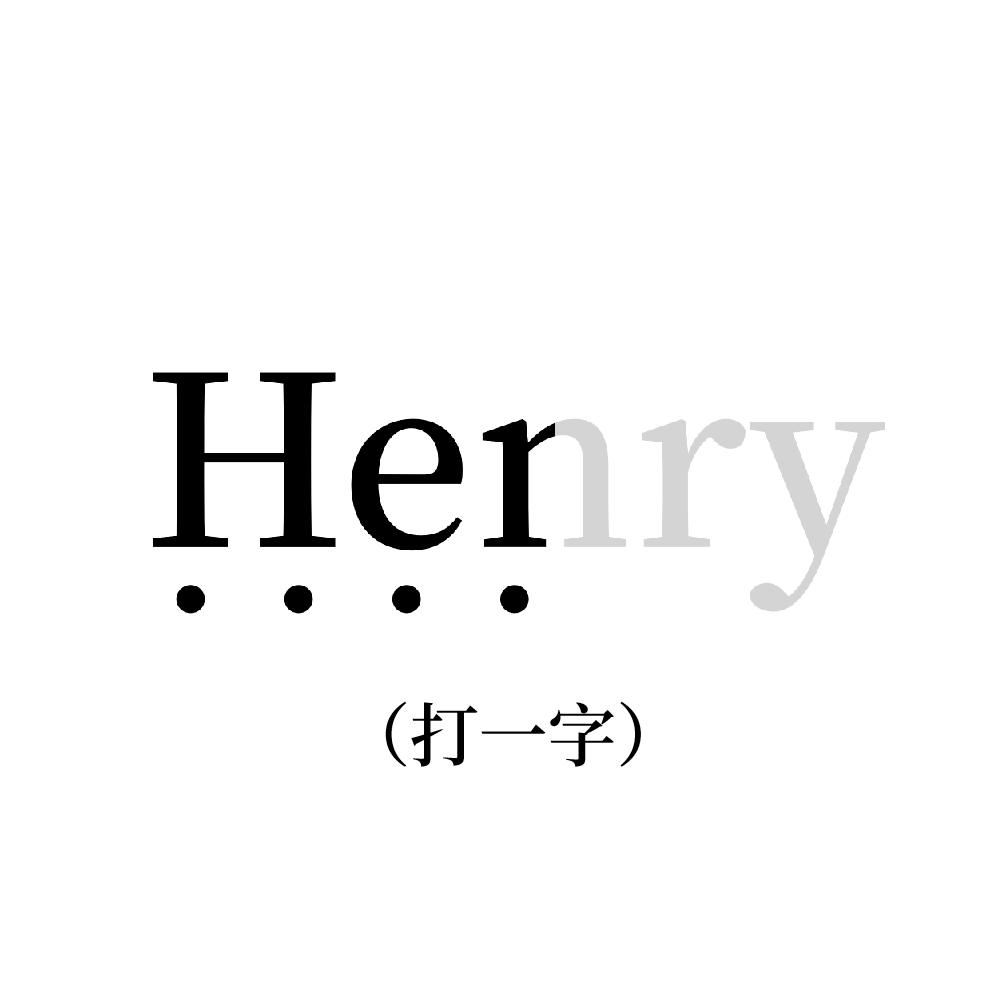

# 千字谜子题 480

## 题面

## 答案

`烹`

## 解析

人名Henry的中文译名为“亨利”，图中黑色部分为左半部分，则取“亨利”的第一个字“亨”；下方有四个点可视为“亨”下方的四个点，组合可形成“烹”字。

## 本地附件

- [47852dffd0de4dfcaa5c15d6cb02f844.webp](../../../assets/static.cipherpuzzles.com/static/images/47852dffd0de4dfcaa5c15d6cb02f844.webp)

来源：[https://ccbc16.cipherpuzzles.com/data/c16-qian-puzzle.json#cid=480](https://ccbc16.cipherpuzzles.com/data/c16-qian-puzzle.json#cid=480)
