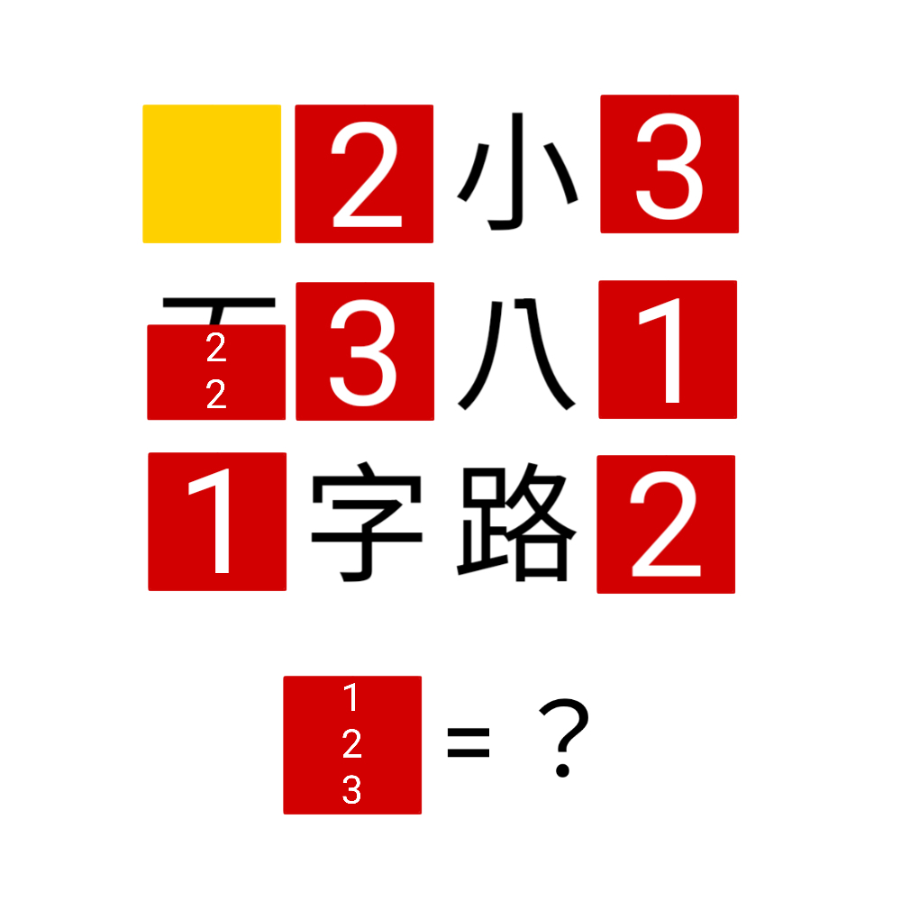

# 千字谜子题 484

## 题面

## 答案

`克`

## 解析

_官方存档未填写解析。_

## 本地附件

- [5adfb3a230cf4a83b14921d695b98fbe.webp](../../../assets/static.cipherpuzzles.com/static/images/5adfb3a230cf4a83b14921d695b98fbe.webp)

来源：[https://ccbc16.cipherpuzzles.com/data/c16-qian-puzzle.json#cid=484](https://ccbc16.cipherpuzzles.com/data/c16-qian-puzzle.json#cid=484)
