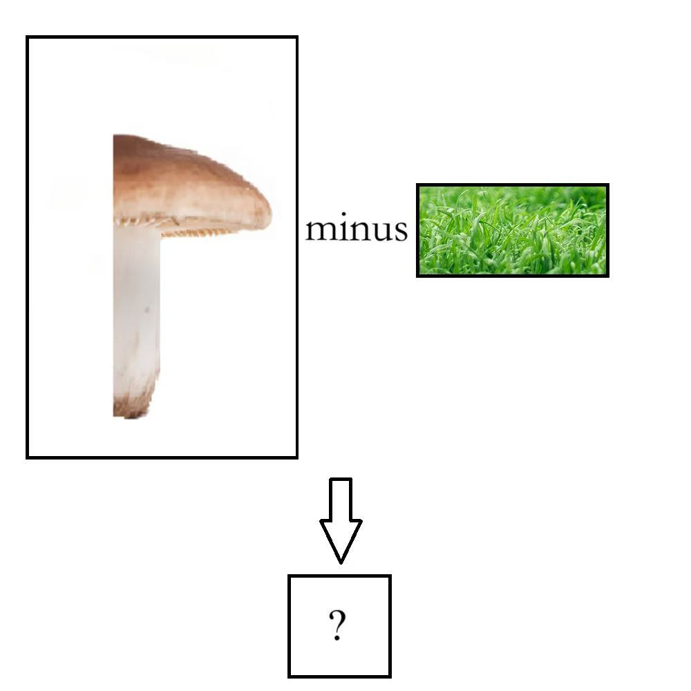

# 千字谜子题 485

## 题面

## 答案

`姑`

## 解析

“蘑菇”的右边一半是“菇”，减去草字头就是“姑”

## 本地附件

- [6b43e686010e46d2b13cda52ecd22ffa.webp](../../../assets/static.cipherpuzzles.com/static/images/6b43e686010e46d2b13cda52ecd22ffa.webp)

来源：[https://ccbc16.cipherpuzzles.com/data/c16-qian-puzzle.json#cid=485](https://ccbc16.cipherpuzzles.com/data/c16-qian-puzzle.json#cid=485)
