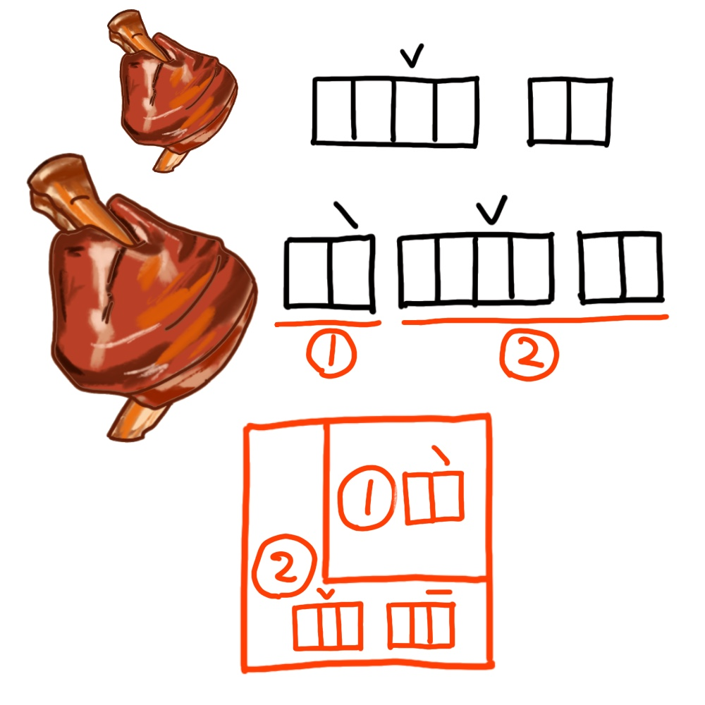

# 千字谜子题 486

## 题面

## 答案

`达`

## 解析

肘子、大肘子、大走之，令人忍俊不禁。

## 本地附件

- [43a45daa9957413486927b581b0cd0eb.webp](../../../assets/static.cipherpuzzles.com/static/images/43a45daa9957413486927b581b0cd0eb.webp)

来源：[https://ccbc16.cipherpuzzles.com/data/c16-qian-puzzle.json#cid=486](https://ccbc16.cipherpuzzles.com/data/c16-qian-puzzle.json#cid=486)
