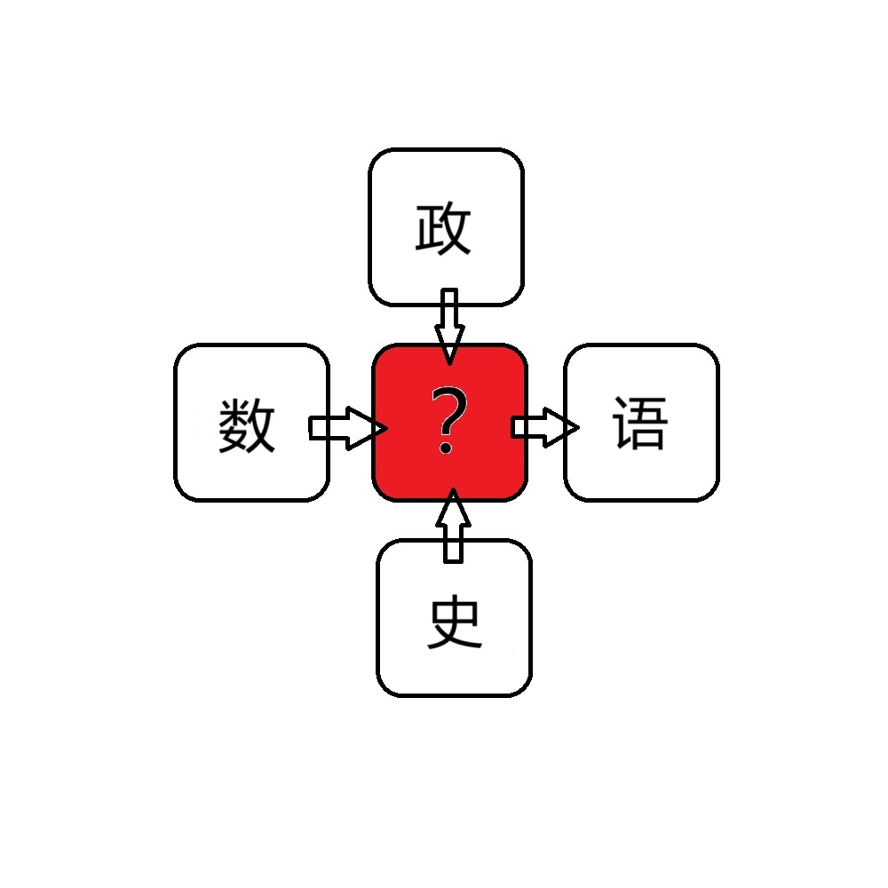

# 千字谜子题 488

## 题面

## 答案

`论`

## 解析

四个学科的简称都可以和论字组词。数论、论语、政论和史论。

## 本地附件

- [ac7f966da0f1434cabf1729e69169655.webp](../../../assets/static.cipherpuzzles.com/static/images/ac7f966da0f1434cabf1729e69169655.webp)

来源：[https://ccbc16.cipherpuzzles.com/data/c16-qian-puzzle.json#cid=488](https://ccbc16.cipherpuzzles.com/data/c16-qian-puzzle.json#cid=488)
