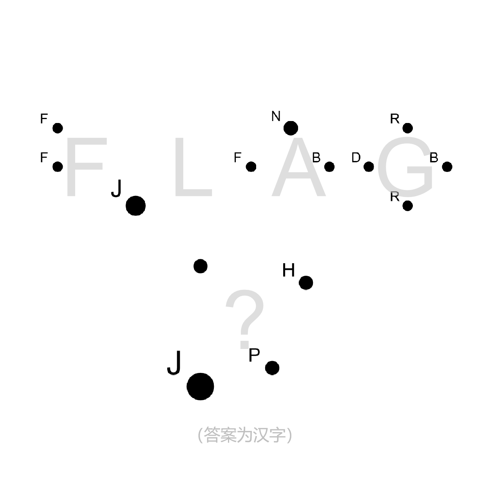

# 千字谜子题 49

## 题面

## 答案

`辽`

## 解析

flag暗示本题要用到旗语，即在每个圆点处添加对应字母的双旗旗语。其中，“旗杆”的长度与圆点的大小成正比。由此题目上半部分便会形成FLAG的象形。同样地处理下面三个带字母的圆点，加上左上角的“点”，可以象形得到答案汉字“辽”。

## 本地附件

- [c5c44136ac1246fc9a332c34b575e8e1.webp](../../../assets/static.cipherpuzzles.com/static/images/c5c44136ac1246fc9a332c34b575e8e1.webp)

来源：[https://ccbc16.cipherpuzzles.com/data/c16-qian-puzzle.json#cid=49](https://ccbc16.cipherpuzzles.com/data/c16-qian-puzzle.json#cid=49)
