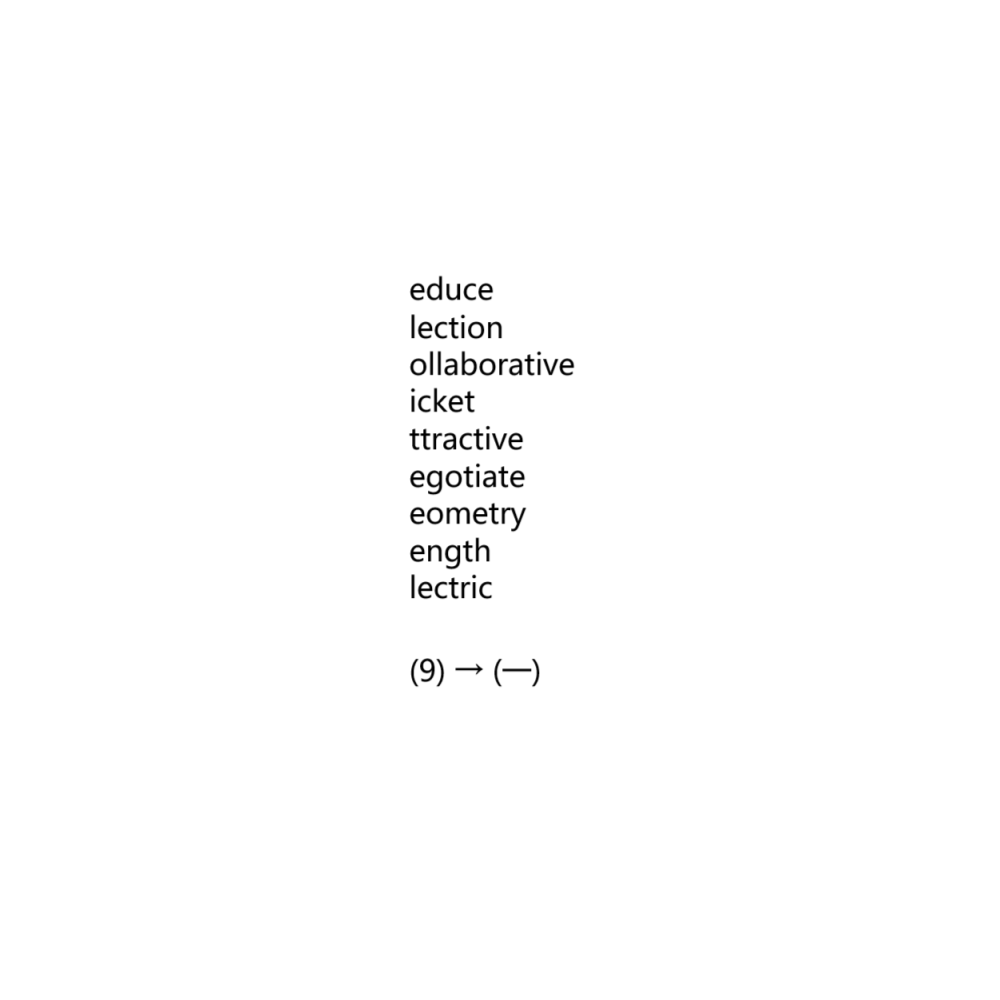

# 千字谜子题 490

## 题面

## 答案

`矩`

## 解析

补全单词首字母，得RECTANGLE
由(9) →（一）得答案矩

## 本地附件

- [15fcb7c8241c4a2eb46ed8cbbe9e287f.webp](../../../assets/static.cipherpuzzles.com/static/images/15fcb7c8241c4a2eb46ed8cbbe9e287f.webp)

来源：[https://ccbc16.cipherpuzzles.com/data/c16-qian-puzzle.json#cid=490](https://ccbc16.cipherpuzzles.com/data/c16-qian-puzzle.json#cid=490)
