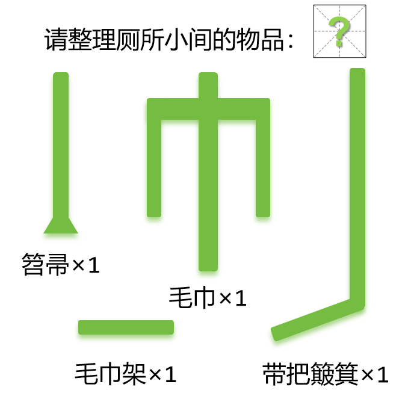

# 千字谜子题 491

## 题面

## 答案

`师`

## 解析

将上述四个部分重新组合，笤帚和簸箕放一起，毛巾置于毛巾架之下，得汉字“师”。

## 本地附件

- [19838e2d62204e96b55b3fea37b125f1.webp](../../../assets/static.cipherpuzzles.com/static/images/19838e2d62204e96b55b3fea37b125f1.webp)

来源：[https://ccbc16.cipherpuzzles.com/data/c16-qian-puzzle.json#cid=491](https://ccbc16.cipherpuzzles.com/data/c16-qian-puzzle.json#cid=491)
