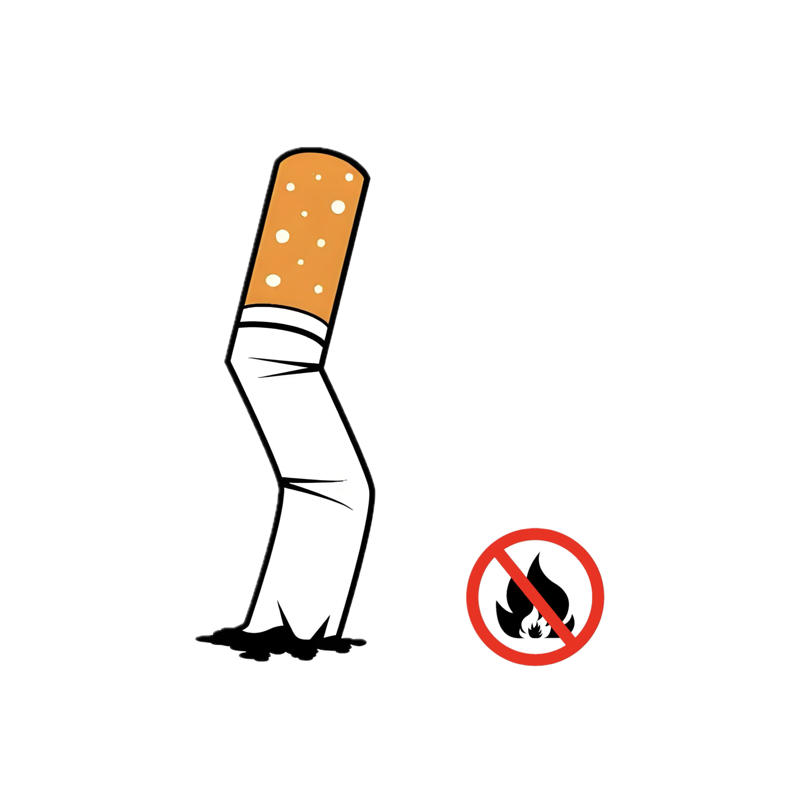

# 千字谜子题 492

## 题面

## 答案

`因`

## 解析

烟-火=因

## 本地附件

- [036abb18129c4dd1aab592384d1a7b38.webp](../../../assets/static.cipherpuzzles.com/static/images/036abb18129c4dd1aab592384d1a7b38.webp)

来源：[https://ccbc16.cipherpuzzles.com/data/c16-qian-puzzle.json#cid=492](https://ccbc16.cipherpuzzles.com/data/c16-qian-puzzle.json#cid=492)
