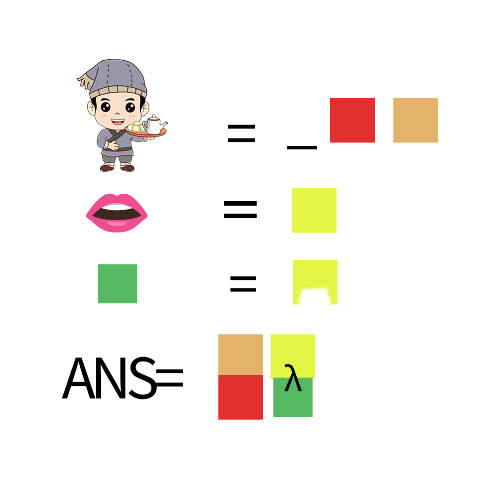

# 千字谜子题 493

## 题面

## 答案

`祸`

## 解析

第一行为店小二，第二行为口，第三行为口去掉下面的横，将各个部分带入，结合λ，得到祸

## 本地附件

- [09c7cf4c84f047a397fe261f41f7e0de.webp](../../../assets/static.cipherpuzzles.com/static/images/09c7cf4c84f047a397fe261f41f7e0de.webp)

来源：[https://ccbc16.cipherpuzzles.com/data/c16-qian-puzzle.json#cid=493](https://ccbc16.cipherpuzzles.com/data/c16-qian-puzzle.json#cid=493)
