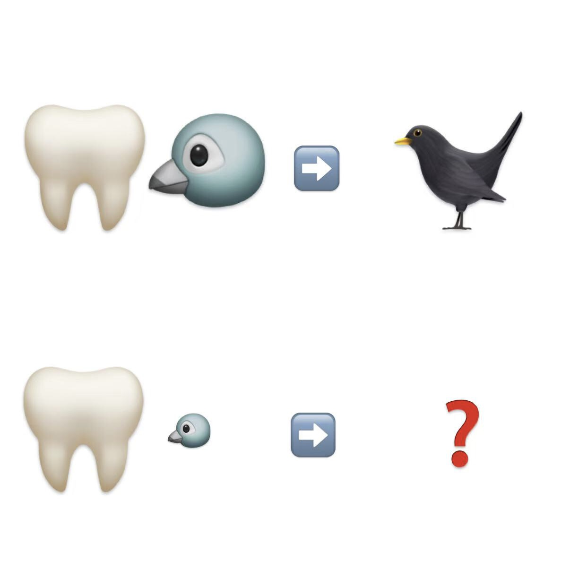

# 千字谜子题 495

## 题面

## 答案

`雅`

## 解析

牙齿（🦷）和鸟（🐦）组成乌鸦（🐦‍⬛）
牙齿（🦷）和小鸟（隹）组成雅

## 本地附件

- [2421c867b2fc4bf6936d01c54ef0a9a6.webp](../../../assets/static.cipherpuzzles.com/static/images/2421c867b2fc4bf6936d01c54ef0a9a6.webp)

来源：[https://ccbc16.cipherpuzzles.com/data/c16-qian-puzzle.json#cid=495](https://ccbc16.cipherpuzzles.com/data/c16-qian-puzzle.json#cid=495)
