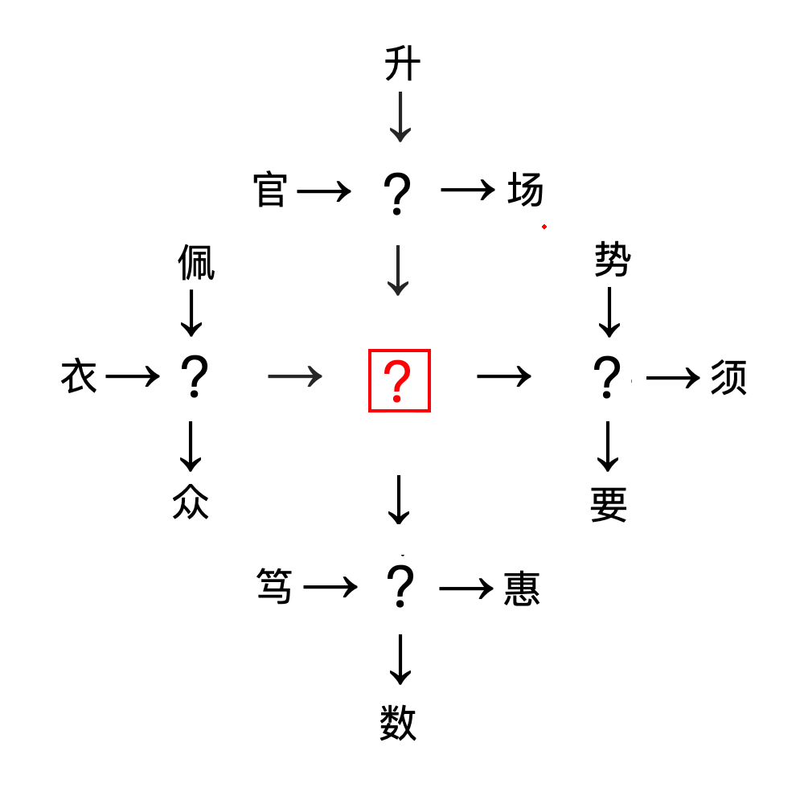

# 千字谜子题 496

## 题面

## 答案

`务`

## 解析

按组词规则，左边应填入服，右边应填入必，上边应填入职，下边应填入实，中间应填入务。

## 本地附件

- [c3d0d5cd91ba4c61977e11b6c226531c.webp](../../../assets/static.cipherpuzzles.com/static/images/c3d0d5cd91ba4c61977e11b6c226531c.webp)

来源：[https://ccbc16.cipherpuzzles.com/data/c16-qian-puzzle.json#cid=496](https://ccbc16.cipherpuzzles.com/data/c16-qian-puzzle.json#cid=496)
