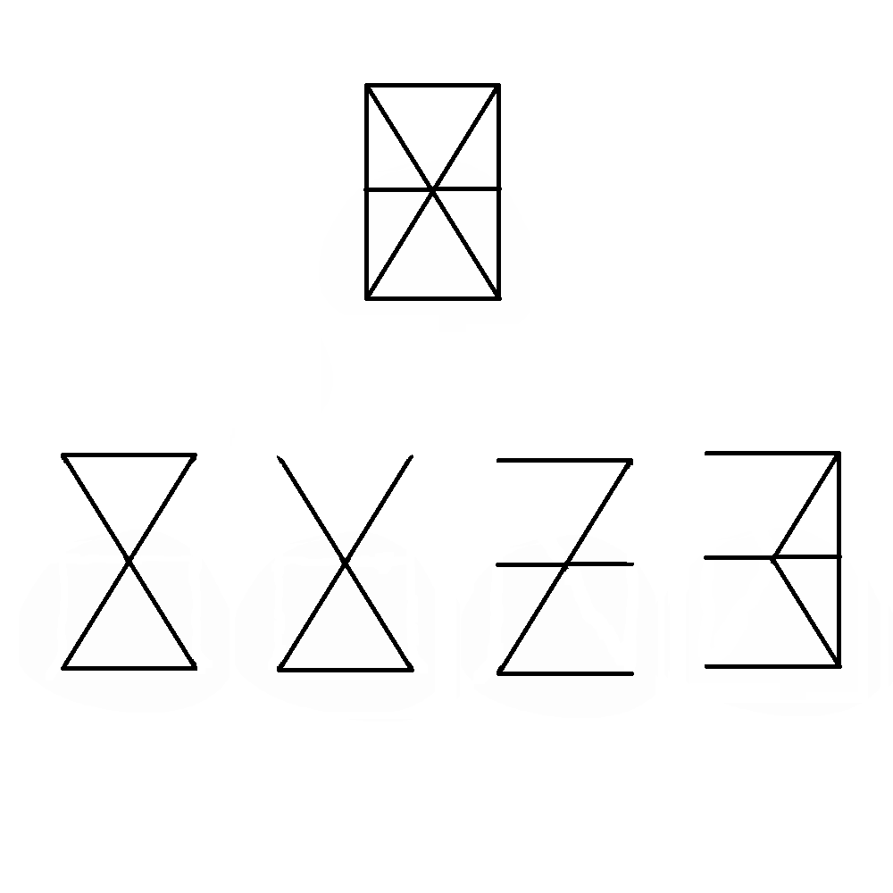

# 千字谜子题 498

## 题面

## 答案

`手`

## 解析

被擦除的部分可以组成英文字母HAND，也就是手
欧内的手好汉

## 本地附件

- [087b2948dcff491696094114e2104d4e.webp](../../../assets/static.cipherpuzzles.com/static/images/087b2948dcff491696094114e2104d4e.webp)

来源：[https://ccbc16.cipherpuzzles.com/data/c16-qian-puzzle.json#cid=498](https://ccbc16.cipherpuzzles.com/data/c16-qian-puzzle.json#cid=498)
