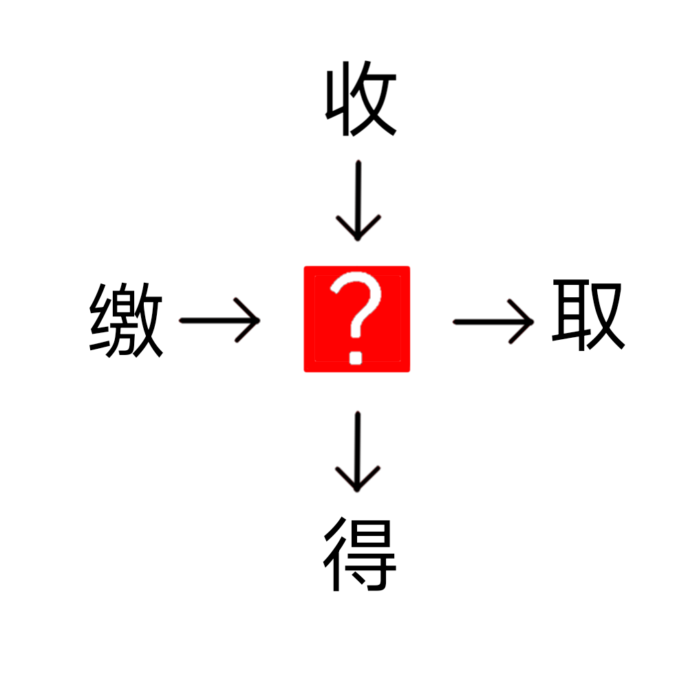

# 千字谜子题 499

## 题面

## 答案

`获`

## 解析

组词，可得“收获”“缴获“获得”“获取”

## 本地附件

- [1ec1ad0af67d40119f7dbc8f3c82546f.webp](../../../assets/static.cipherpuzzles.com/static/images/1ec1ad0af67d40119f7dbc8f3c82546f.webp)

来源：[https://ccbc16.cipherpuzzles.com/data/c16-qian-puzzle.json#cid=499](https://ccbc16.cipherpuzzles.com/data/c16-qian-puzzle.json#cid=499)
