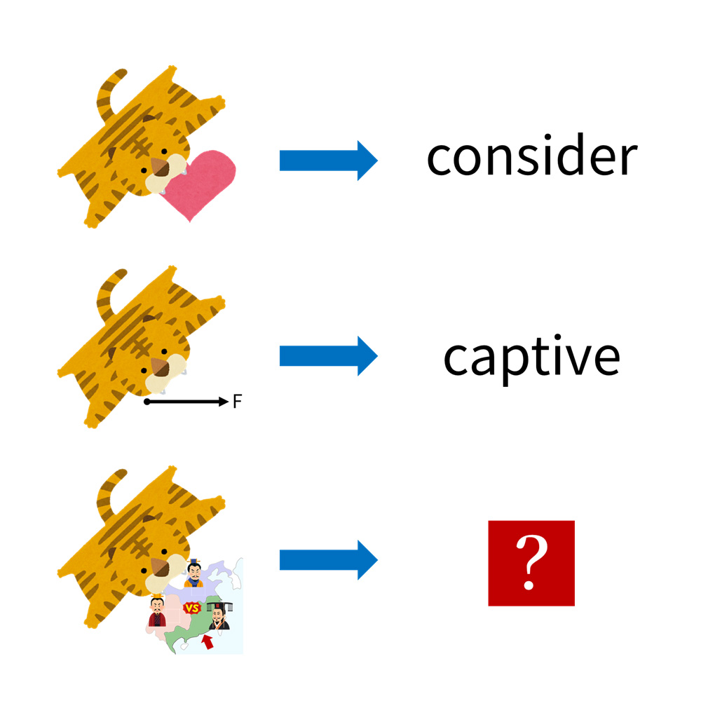

# 千字谜子题 50

## 题面

## 答案

`虞`

## 解析

虎皮代表“虍”，前两行代表“虑”和“虏”，第三行表示“虞”

## 本地附件

- [0a70dcb6e70e4a55a644b46c2bd9c778.webp](../../../assets/static.cipherpuzzles.com/static/images/0a70dcb6e70e4a55a644b46c2bd9c778.webp)

来源：[https://ccbc16.cipherpuzzles.com/data/c16-qian-puzzle.json#cid=50](https://ccbc16.cipherpuzzles.com/data/c16-qian-puzzle.json#cid=50)
