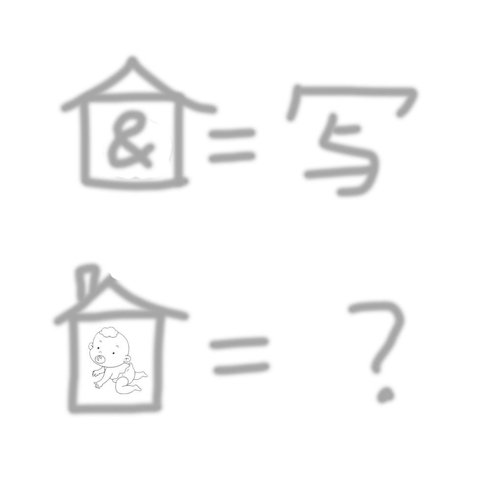

# 千字谜子题 500

## 题面

## 答案

`字`

## 解析

象形，由第一张图可得房子=没有点的宝盖头，&=与，第二张图带烟囱的房子=带点的宝盖头，婴儿=子，合在一起即为“字”

## 本地附件

- [821bed5b4d6348628ee4df69943c94fa.webp](../../../assets/static.cipherpuzzles.com/static/images/821bed5b4d6348628ee4df69943c94fa.webp)

来源：[https://ccbc16.cipherpuzzles.com/data/c16-qian-puzzle.json#cid=500](https://ccbc16.cipherpuzzles.com/data/c16-qian-puzzle.json#cid=500)
