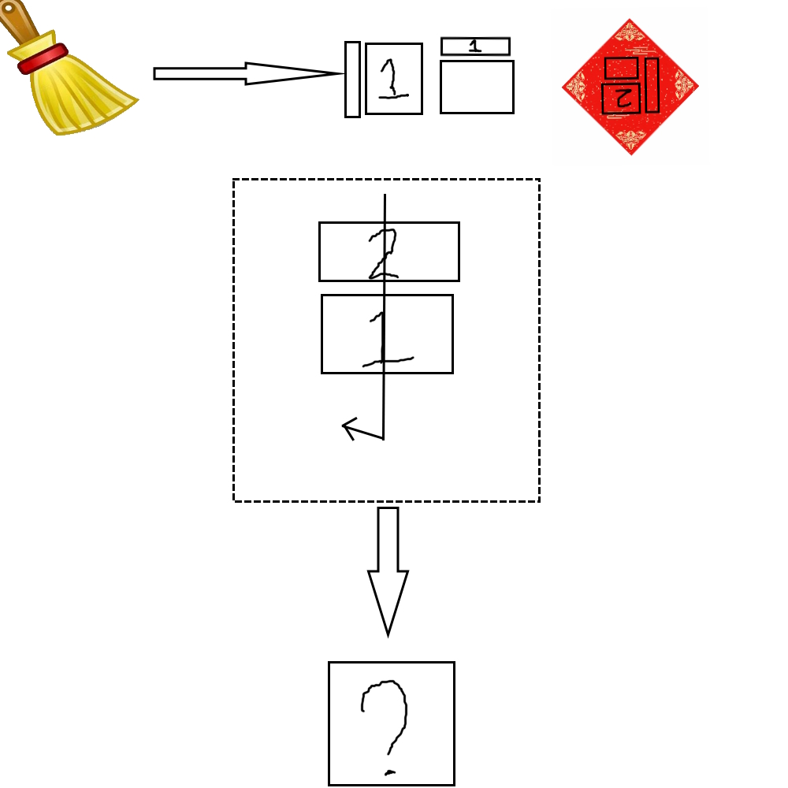

# 千字谜子题 501

## 题面

## 答案

`事`

## 解析

识图，由“扫帚”可知（1）部分为“彐”
倒过来的福字可知（2）部分为一横加一口
最后虚线部分看似是沿箭头读取，实则是象形
令人忍俊不禁

## 本地附件

- [727a4c169efe4fd8ba7deb1f963078d1.webp](../../../assets/static.cipherpuzzles.com/static/images/727a4c169efe4fd8ba7deb1f963078d1.webp)

来源：[https://ccbc16.cipherpuzzles.com/data/c16-qian-puzzle.json#cid=501](https://ccbc16.cipherpuzzles.com/data/c16-qian-puzzle.json#cid=501)
