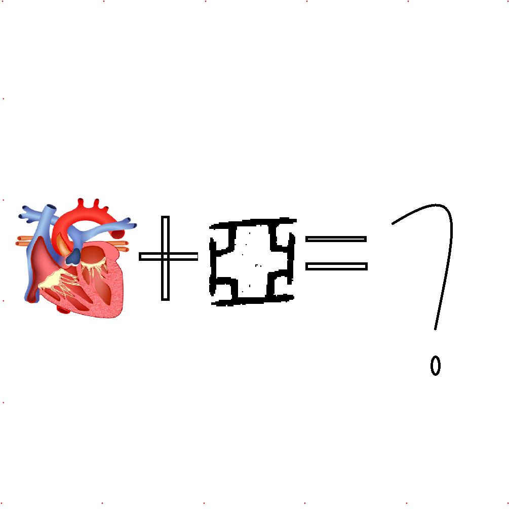

# 千字谜子题 502

## 题面

## 答案

`恶`

## 解析

左边是个心，右边是甲骨文的亚，加起来就是恶

## 本地附件

- [74f1925ba6034e30b29e6cc4ab234371.webp](../../../assets/static.cipherpuzzles.com/static/images/74f1925ba6034e30b29e6cc4ab234371.webp)

来源：[https://ccbc16.cipherpuzzles.com/data/c16-qian-puzzle.json#cid=502](https://ccbc16.cipherpuzzles.com/data/c16-qian-puzzle.json#cid=502)
