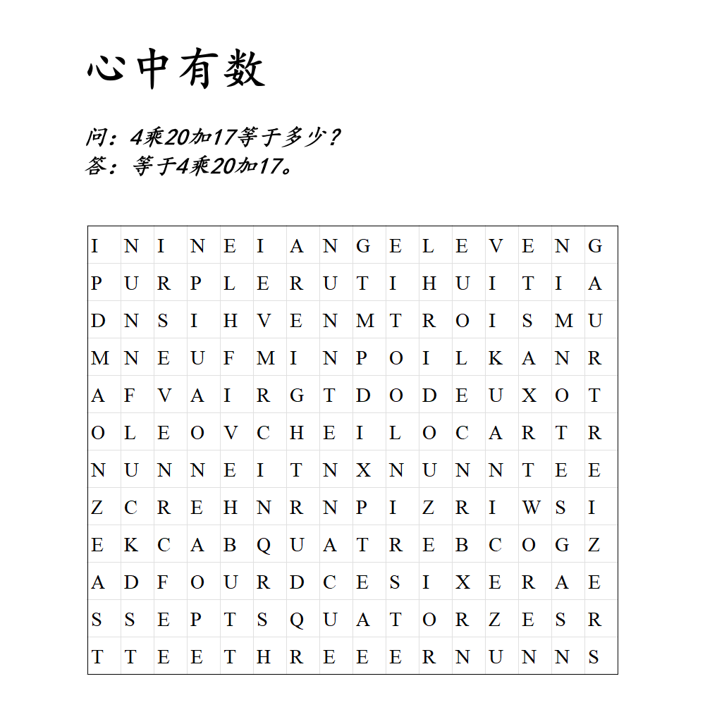

# 千字谜子题 506

## 题面

## 答案

`的`

## 解析

标题暗示在字母方阵中找出表示数字的单词，风味文本暗示要找法语数字（法语中97表达为4*20+17（quatre-vingt-dix-sept）），即un,deux,trois,...
找到法语数字1到14的单词后发现每个单词两侧均为相同的字母（例如1为N[UN]N,2为O[DEUX]O），按1到14提取这个字母，得到NOMBRESIMPAIRS，即NOMBRES IMPAIRS。这是一个法语词汇，意为“奇数”。将上一步找到的所有奇数及其两侧的格子标记出来（如涂红），观察所有标记的格子，象形得到答案“的”。

## 本地附件

- [bd5b4823101e474da2bba3a0af2774f0.webp](../../../assets/static.cipherpuzzles.com/static/images/bd5b4823101e474da2bba3a0af2774f0.webp)

来源：[https://ccbc16.cipherpuzzles.com/data/c16-qian-puzzle.json#cid=506](https://ccbc16.cipherpuzzles.com/data/c16-qian-puzzle.json#cid=506)
