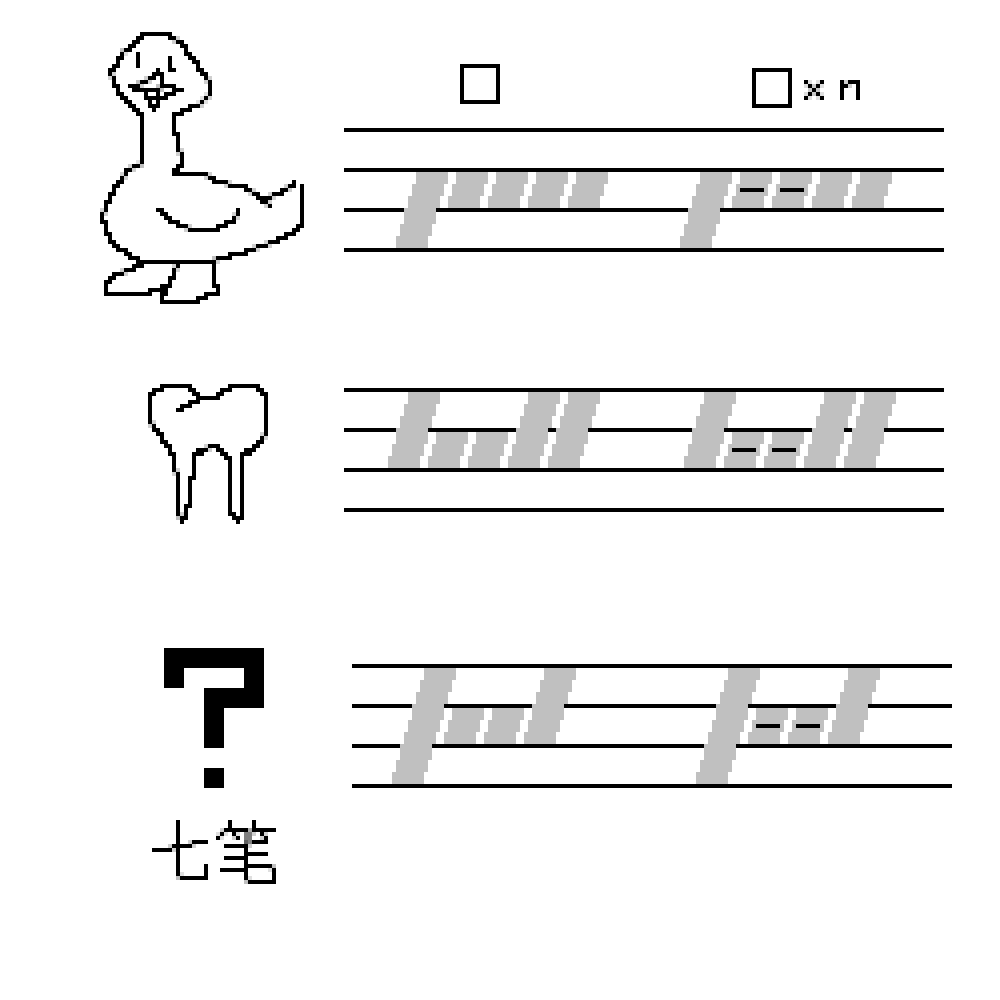

# 千字谜子题 507

## 题面

## 答案

`足`

## 解析

题目展示了英文名词复数的特殊变化。从上到下依次为鹅(goose→geese)，牙(tooth→teeth)和未知。每组的复数变化规律相同，将词语由-oo-转化为-ee-，这也是右侧单词中横杠的由来。结合手写体占据的格子得知，位置单词为foot→feet，结合七笔的笔画数得到最终答案【足】。

## 本地附件

- [174591a9a0d24f1395309b3ed7adf150.webp](../../../assets/static.cipherpuzzles.com/static/images/174591a9a0d24f1395309b3ed7adf150.webp)

来源：[https://ccbc16.cipherpuzzles.com/data/c16-qian-puzzle.json#cid=507](https://ccbc16.cipherpuzzles.com/data/c16-qian-puzzle.json#cid=507)
