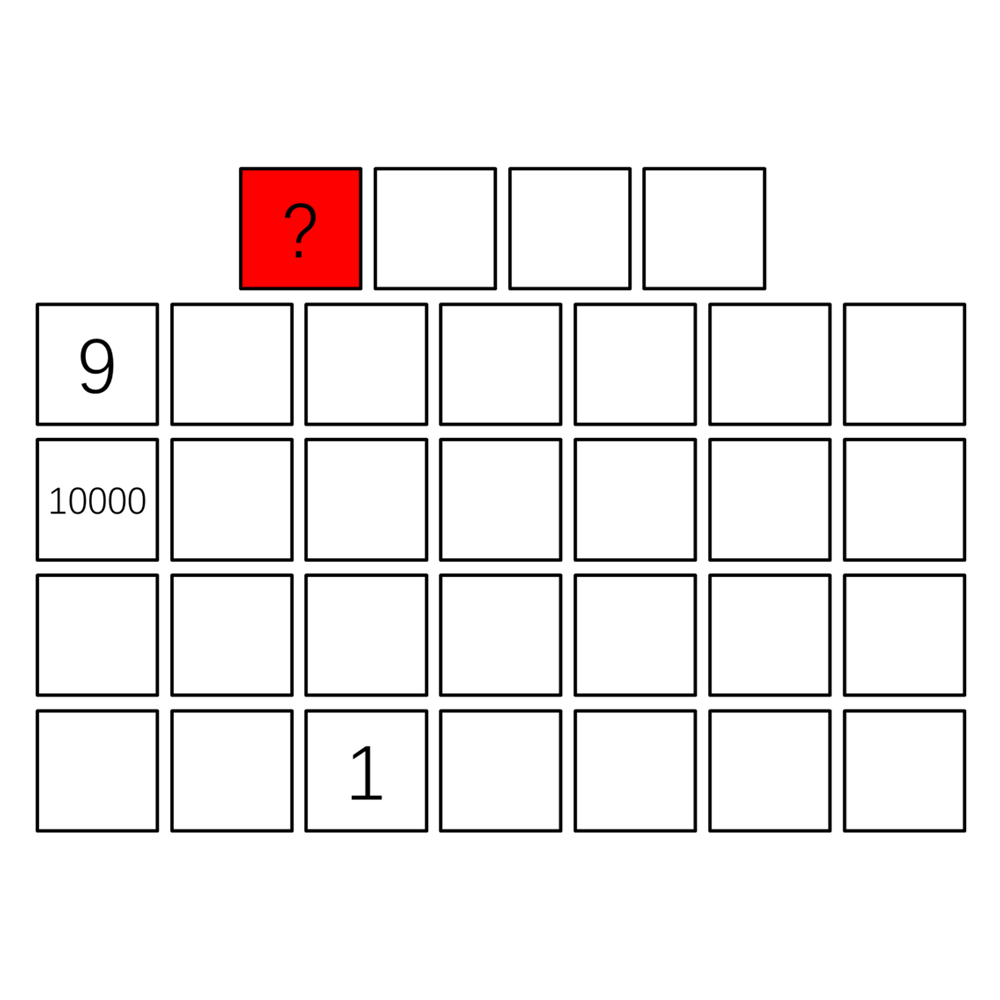

# 千字谜子题 510

## 题面

## 答案

`己`

## 解析

方格对应《己亥杂诗》（九州生气恃风雷）诗句。

## 本地附件

- [9ebf92e6b3764a04a7b5b7146f5ecf0c.webp](../../../assets/static.cipherpuzzles.com/static/images/9ebf92e6b3764a04a7b5b7146f5ecf0c.webp)

来源：[https://ccbc16.cipherpuzzles.com/data/c16-qian-puzzle.json#cid=510](https://ccbc16.cipherpuzzles.com/data/c16-qian-puzzle.json#cid=510)
