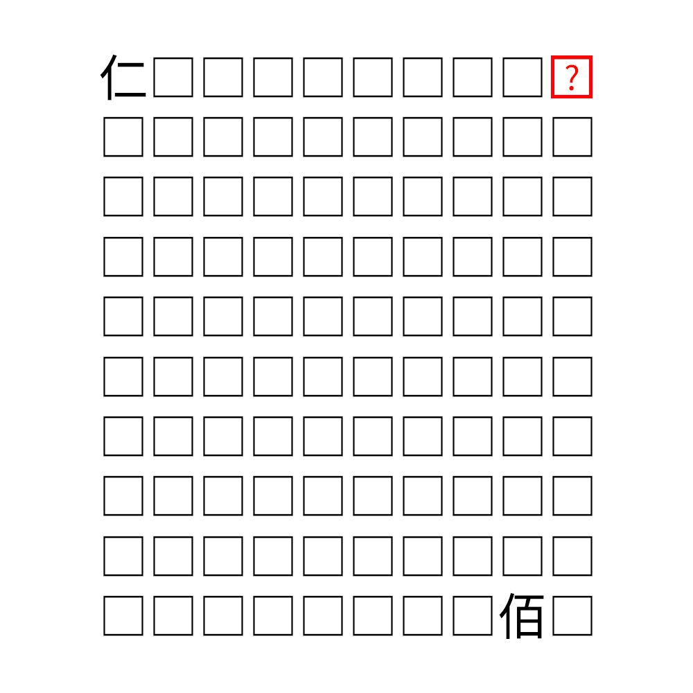

# 千字谜子题 512

## 题面

## 答案

`仕`

## 解析

观察到仁和佰之间正好有97个框，所以每个框中的右半部分代表对应位置的数字，即二至一百。红色框的位置对应十一，所以答案是仕。

## 本地附件

- [09cc9554d3d04a8192dd45cb5ac30700.webp](../../../assets/static.cipherpuzzles.com/static/images/09cc9554d3d04a8192dd45cb5ac30700.webp)

来源：[https://ccbc16.cipherpuzzles.com/data/c16-qian-puzzle.json#cid=512](https://ccbc16.cipherpuzzles.com/data/c16-qian-puzzle.json#cid=512)
