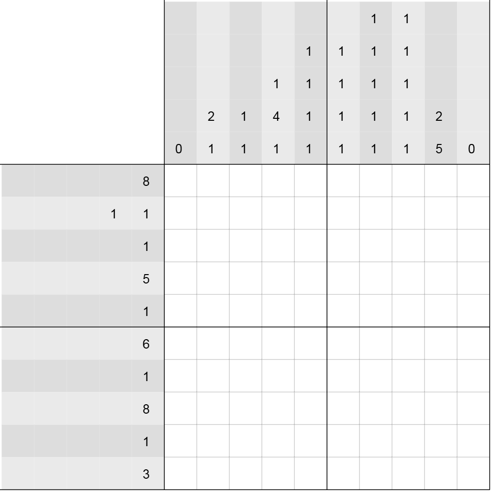

# 千字谜子题 513

## 题面

## 答案

`写`

## 解析

nonogram规则，取黑块就行了

## 本地附件

- [e823561018234008a088e39fb15a8a4d.webp](../../../assets/static.cipherpuzzles.com/static/images/e823561018234008a088e39fb15a8a4d.webp)

来源：[https://ccbc16.cipherpuzzles.com/data/c16-qian-puzzle.json#cid=513](https://ccbc16.cipherpuzzles.com/data/c16-qian-puzzle.json#cid=513)
