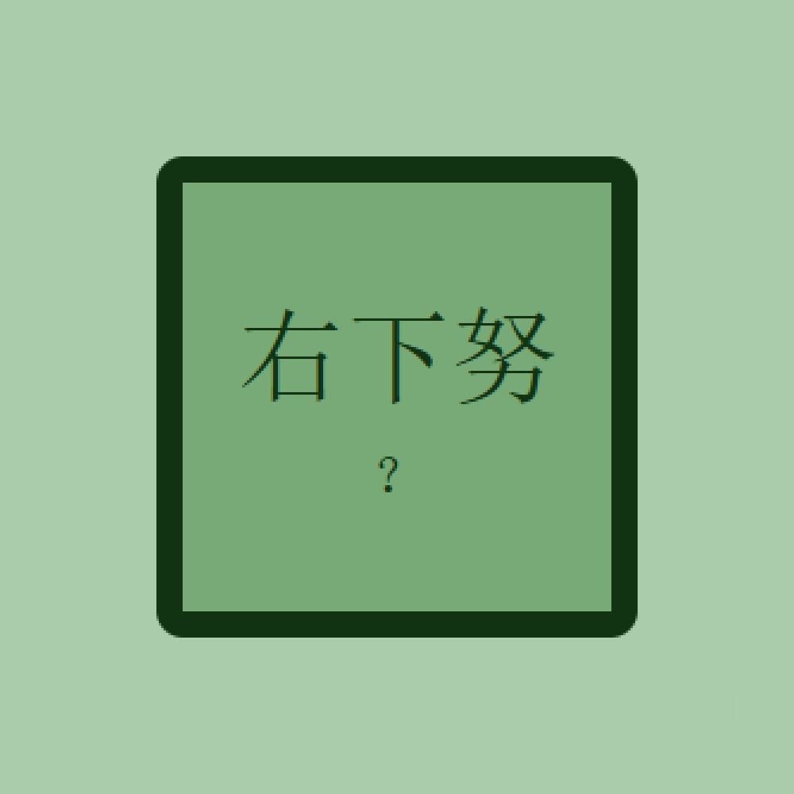

# 千字谜子题 514

## 题面

## 答案

`劝`

## 解析

提取“又”和“力”拼字即可

## 本地附件

- [8d9e54a8a0d84619b38ee29f512b62af.webp](../../../assets/static.cipherpuzzles.com/static/images/8d9e54a8a0d84619b38ee29f512b62af.webp)

来源：[https://ccbc16.cipherpuzzles.com/data/c16-qian-puzzle.json#cid=514](https://ccbc16.cipherpuzzles.com/data/c16-qian-puzzle.json#cid=514)
