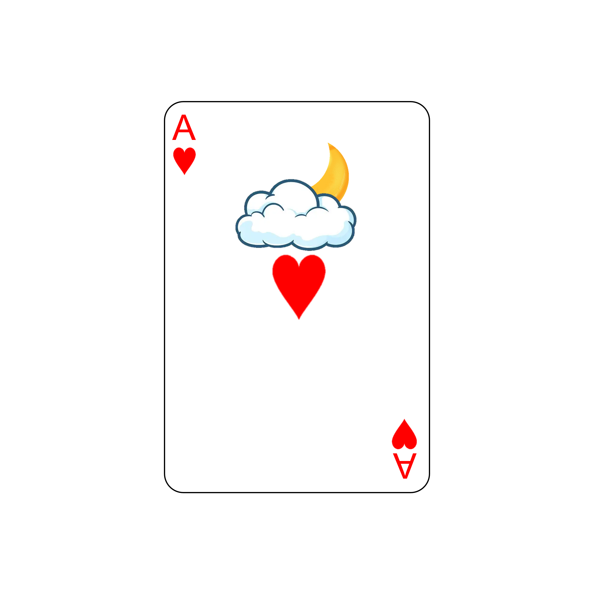

# 千字谜子题 517

## 题面

## 答案

`悬`

## 解析

上半部分是被挡住一部分的“月”和“云”，按照上下关系组成“县”字，下半部分是红桃“心”，组合成悬

## 本地附件

- [83464888e27b460ab460d101a12448e1.webp](../../../assets/static.cipherpuzzles.com/static/images/83464888e27b460ab460d101a12448e1.webp)

来源：[https://ccbc16.cipherpuzzles.com/data/c16-qian-puzzle.json#cid=517](https://ccbc16.cipherpuzzles.com/data/c16-qian-puzzle.json#cid=517)
