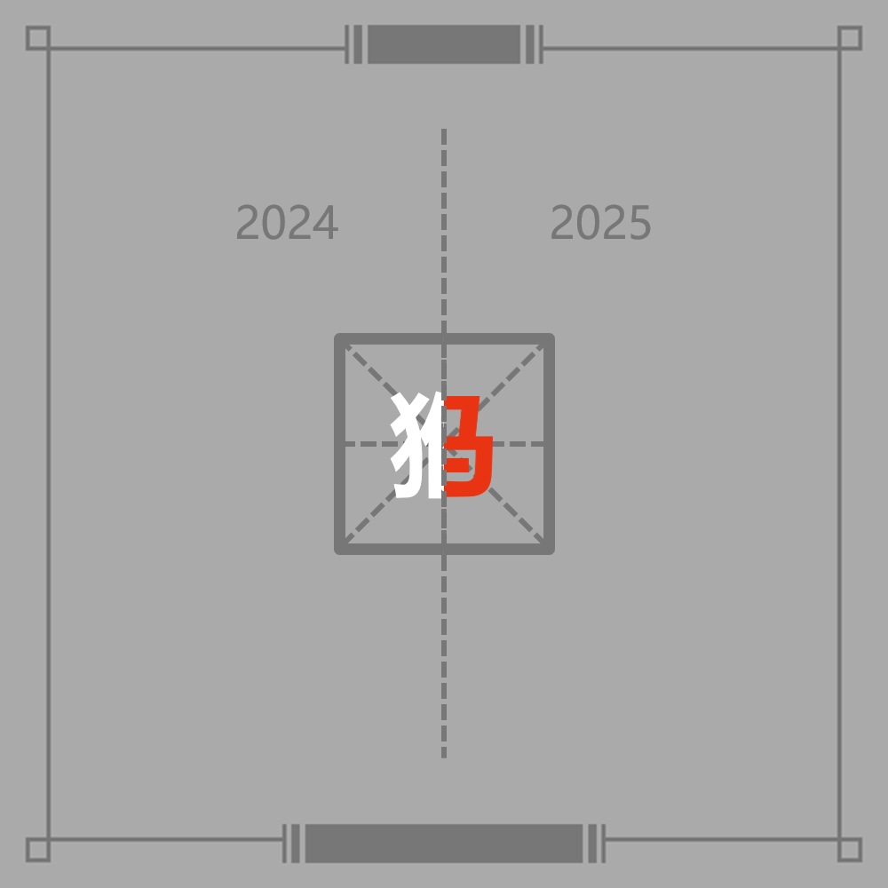

# 千字谜子题 52

## 题面

## 答案

`诚`

## 解析

题目由两个部分拼接而成，左半边是2024和白色的猴字，右半边是2025和红色的马字，这些元素均来自四方谜。2024年的猴对应的题目是第23题，其中白色部分为“说”字，从而提取其左半边“讠”；2025年的马对应的题目是第6题，其中红色部分为城堡的图标，米字格暗示应该用一个汉字“城”表示，从而提取其右半边“成”。左右拼接在一起为“诚”字。

## 本地附件

- [cd85571149e74537b131180bd613c250.webp](../../../assets/static.cipherpuzzles.com/static/images/cd85571149e74537b131180bd613c250.webp)

来源：[https://ccbc16.cipherpuzzles.com/data/c16-qian-puzzle.json#cid=52](https://ccbc16.cipherpuzzles.com/data/c16-qian-puzzle.json#cid=52)
