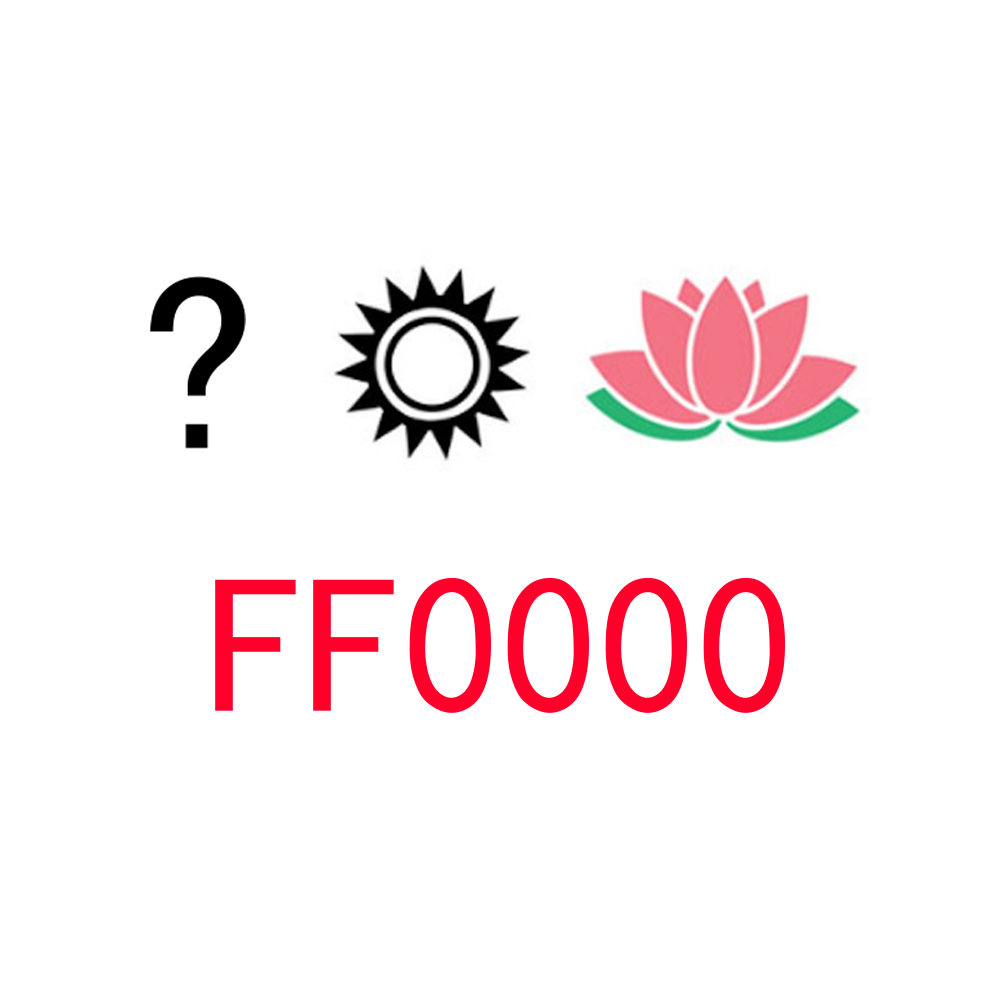

# 千字谜子题 520

## 题面

## 答案

`映`

## 解析

"映"日荷花别样红

## 本地附件

- [c10149d78f4e46f1b9dfd07f8dbcfe18.webp](../../../assets/static.cipherpuzzles.com/static/images/c10149d78f4e46f1b9dfd07f8dbcfe18.webp)

来源：[https://ccbc16.cipherpuzzles.com/data/c16-qian-puzzle.json#cid=520](https://ccbc16.cipherpuzzles.com/data/c16-qian-puzzle.json#cid=520)
