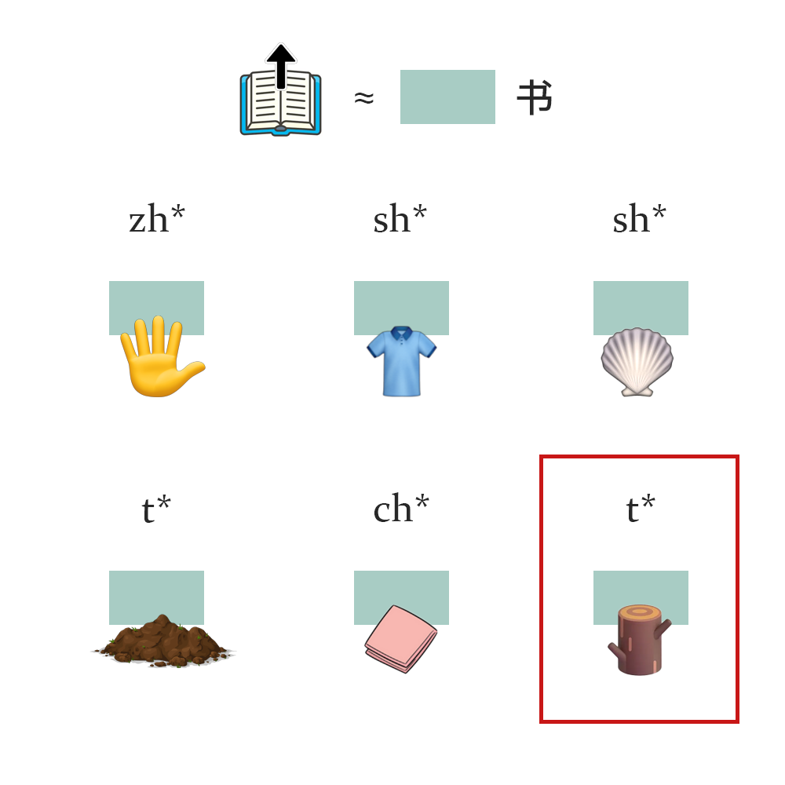

# 千字谜子题 521

## 题面

## 答案

`棠`

## 解析

上书≈尚书
绿色方框部分替换尚，拼音部分*为相同的部分
emoji取接近单字，分别为 掌/裳/赏/堂/常，最后为棠

## 本地附件

- [8b404d7d13b04392848bd839a2196a8d.webp](../../../assets/static.cipherpuzzles.com/static/images/8b404d7d13b04392848bd839a2196a8d.webp)

来源：[https://ccbc16.cipherpuzzles.com/data/c16-qian-puzzle.json#cid=521](https://ccbc16.cipherpuzzles.com/data/c16-qian-puzzle.json#cid=521)
