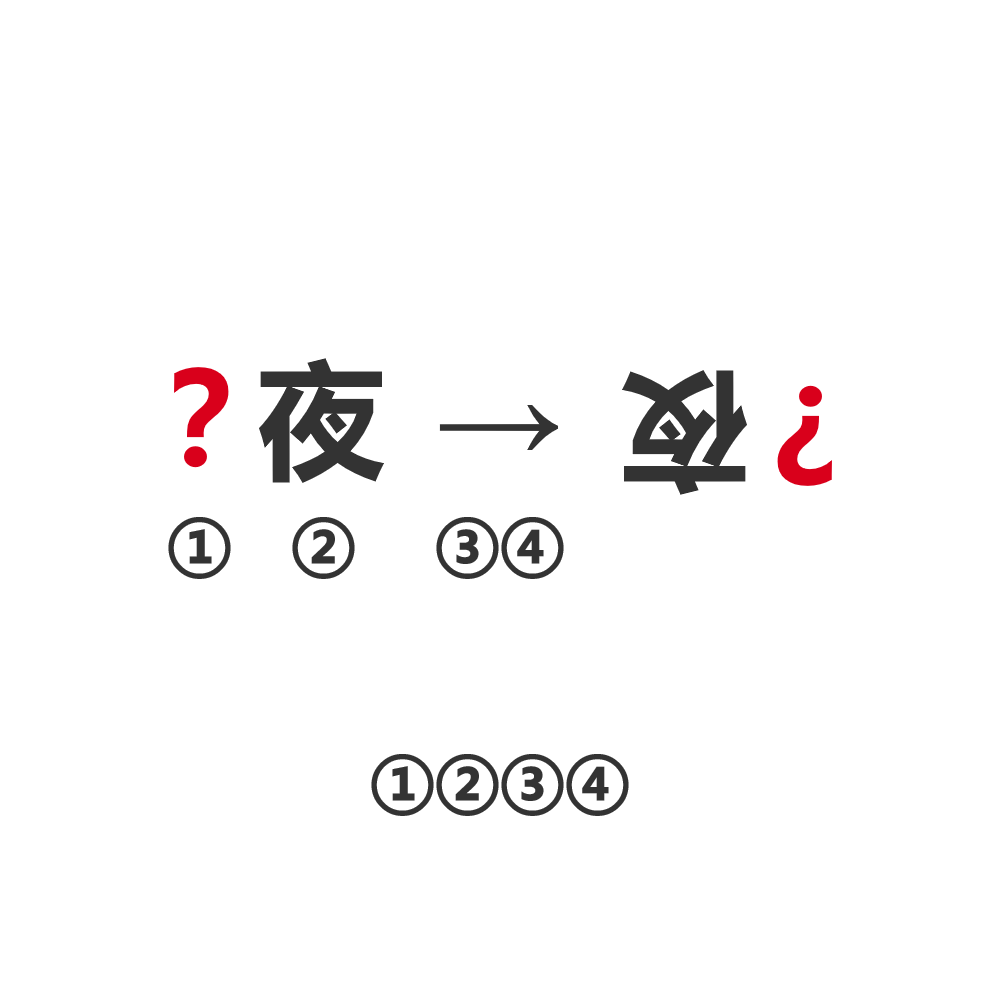

# 千字谜子题 525

## 题面

## 答案

`昼`

## 解析

注意到①②③④可以连成一个词，而②代表的是夜，③④代表的是颠倒的过程，因此应该是昼夜颠倒，其中的红字为“？”，则得到“昼”。

## 本地附件

- [c09785cce6e14ab197d0283f56c90878.webp](../../../assets/static.cipherpuzzles.com/static/images/c09785cce6e14ab197d0283f56c90878.webp)

来源：[https://ccbc16.cipherpuzzles.com/data/c16-qian-puzzle.json#cid=525](https://ccbc16.cipherpuzzles.com/data/c16-qian-puzzle.json#cid=525)
