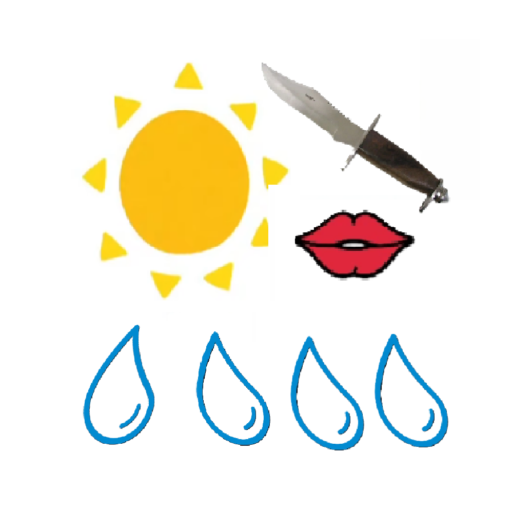

# 千字谜子题 526

## 题面

## 答案

`照`

## 解析

太阳记为“日”，匕首记为“刀”，嘴唇记为“口”，四个水滴记为“灬”，组合在一起，象形成“照”字。

## 本地附件

- [bcdf014d219840d48a4141e49e165d11.webp](../../../assets/static.cipherpuzzles.com/static/images/bcdf014d219840d48a4141e49e165d11.webp)

来源：[https://ccbc16.cipherpuzzles.com/data/c16-qian-puzzle.json#cid=526](https://ccbc16.cipherpuzzles.com/data/c16-qian-puzzle.json#cid=526)
