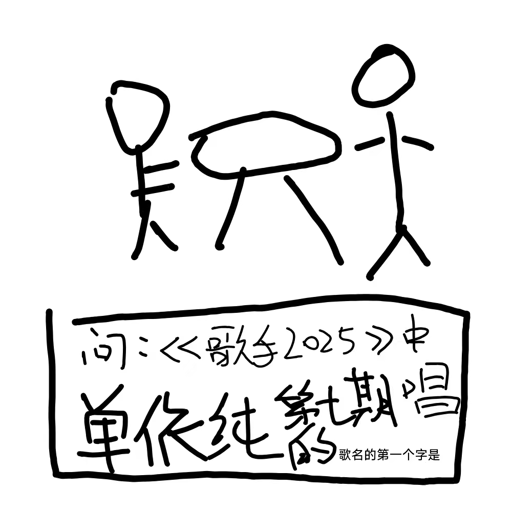

# 千字谜子题 529

## 题面

## 答案

`思`

## 解析

这道题相当有难度，相当考验选手的综艺素养、音乐能力、记忆力等素质。遇到难题的时候应该冷静，耐心。当然可以直接扔进deepseek，但是deepseek再给答案的同时会告诉你难听。同时，这道题可以做成hiddle，因为最关键的字在第16个格子，和雪题一模一样。

## 本地附件

- [1d545e274ac44bb0a5b8c8b71bf17257.webp](../../../assets/static.cipherpuzzles.com/static/images/1d545e274ac44bb0a5b8c8b71bf17257.webp)

来源：[https://ccbc16.cipherpuzzles.com/data/c16-qian-puzzle.json#cid=529](https://ccbc16.cipherpuzzles.com/data/c16-qian-puzzle.json#cid=529)
