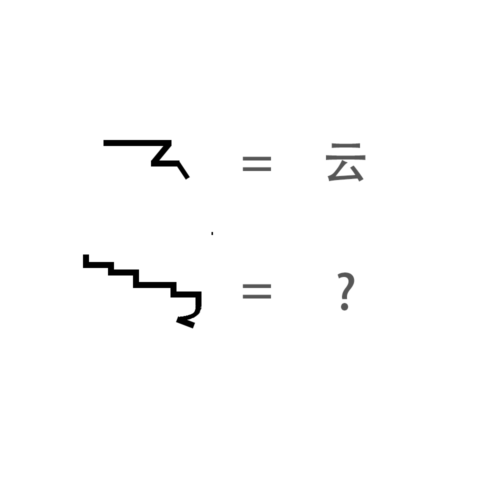

# 千字谜子题 53

## 题面

（九）

## 答案

`贵`

## 解析

你知道吗？所有的汉字都可以一笔画。
就是上一题的做法。

## 本地附件

- [6861300478fa4894bd255390dcbc39fd.webp](../../../assets/static.cipherpuzzles.com/static/images/6861300478fa4894bd255390dcbc39fd.webp)

来源：[https://ccbc16.cipherpuzzles.com/data/c16-qian-puzzle.json#cid=53](https://ccbc16.cipherpuzzles.com/data/c16-qian-puzzle.json#cid=53)
