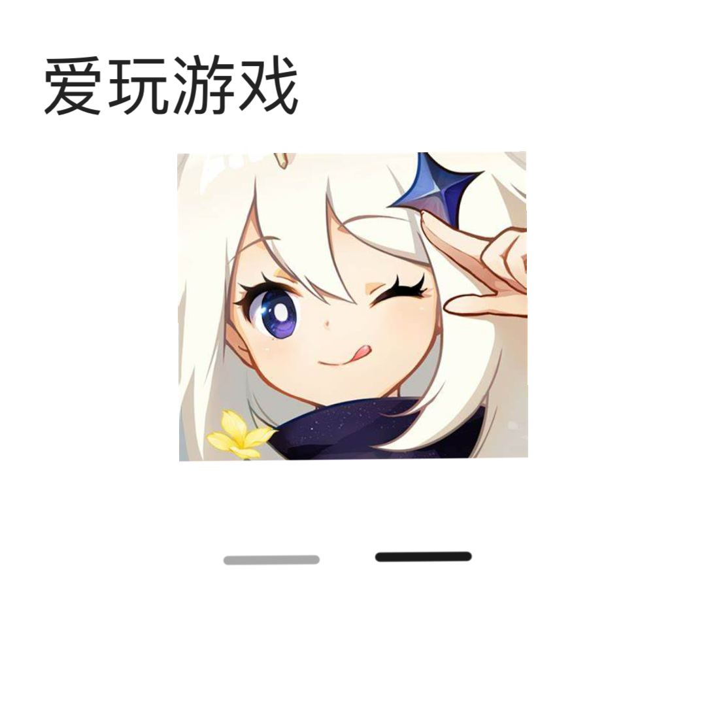

# 千字谜子题 530

## 题面

## 答案

`神`

## 解析

标题中指出这是一种游戏，图中是[原神]的游戏图标，根据下方横线的深浅，取[神]字，所以答案：神

## 本地附件

- [3c63c5c056ef408abc65c8144b12c3e3.webp](../../../assets/static.cipherpuzzles.com/static/images/3c63c5c056ef408abc65c8144b12c3e3.webp)

来源：[https://ccbc16.cipherpuzzles.com/data/c16-qian-puzzle.json#cid=530](https://ccbc16.cipherpuzzles.com/data/c16-qian-puzzle.json#cid=530)
