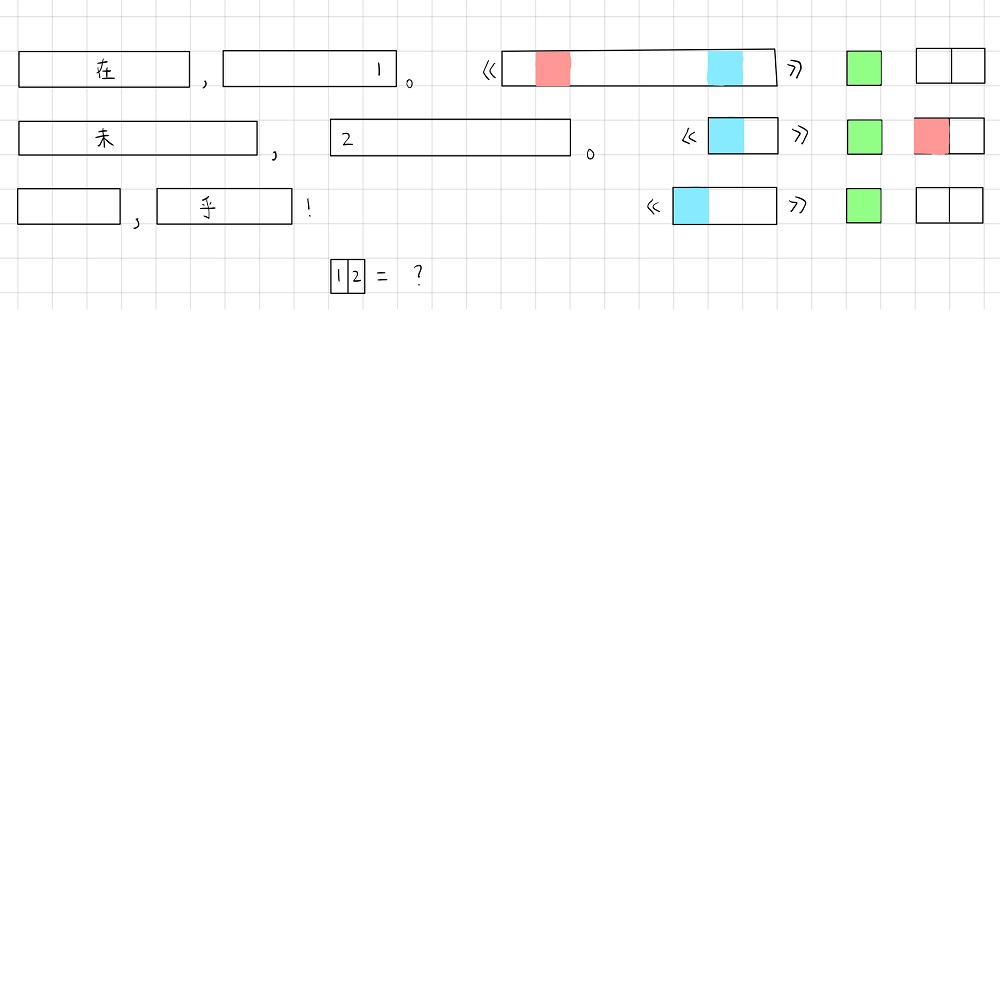

# 千字谜子题 54

## 题面

## 答案

`帐`

## 解析

无为在歧路，儿女共沾巾。《送杜少府之任蜀州》 唐 王勃
出师未捷身先死，长使英雄泪满襟。《蜀相》 唐 杜甫
噫吁嚱，危乎高哉！《蜀道难》 唐 李白
12 = 巾长 = 帐

Note：仓促之间拉到的1000px，位置和分辨率都怪怪的，望不要介意

## 本地附件

- [4d20db97951342828888a0b8ff4f8f37.webp](../../../assets/static.cipherpuzzles.com/static/images/4d20db97951342828888a0b8ff4f8f37.webp)

来源：[https://ccbc16.cipherpuzzles.com/data/c16-qian-puzzle.json#cid=54](https://ccbc16.cipherpuzzles.com/data/c16-qian-puzzle.json#cid=54)
