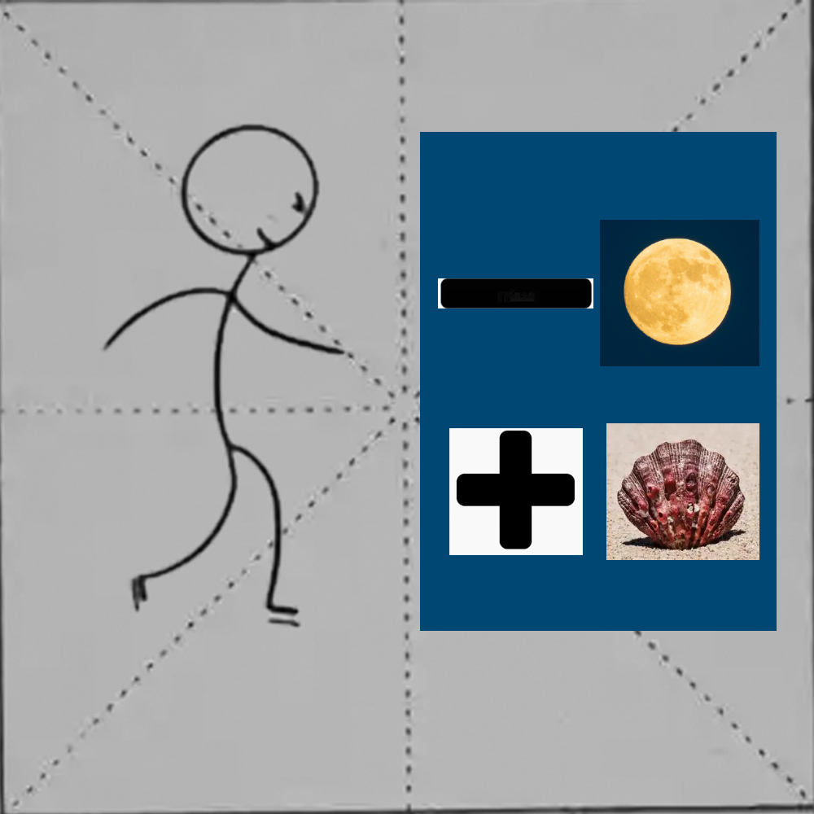

# 千字谜子题 55

## 题面

## 答案

`债`

## 解析

亻+青-月+贝

## 本地附件

- [8102a4dee2164c1599fdf898e75e4707.webp](../../../assets/static.cipherpuzzles.com/static/images/8102a4dee2164c1599fdf898e75e4707.webp)

来源：[https://ccbc16.cipherpuzzles.com/data/c16-qian-puzzle.json#cid=55](https://ccbc16.cipherpuzzles.com/data/c16-qian-puzzle.json#cid=55)
