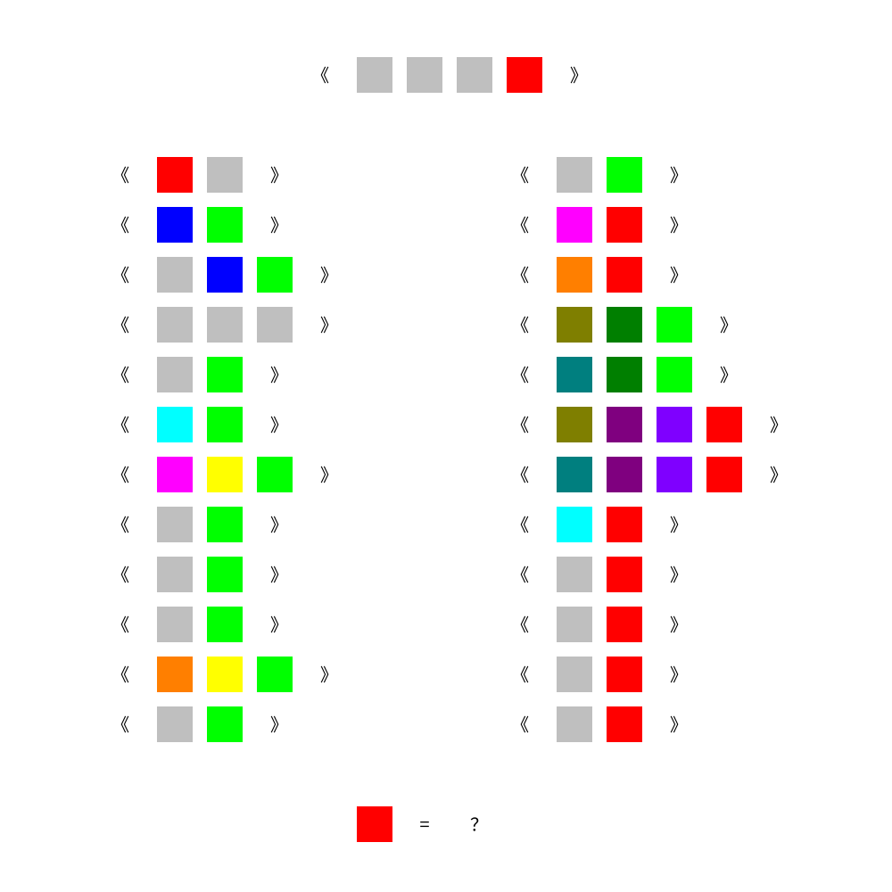

# 千字谜子题 56

## 题面

## 答案

`史`

## 解析

本题中，每个方块代表一个汉字。除了灰色以外，同颜色的方块是相同的汉字。根据二十四个书名号可以可以猜测这些方块组成一组24本书，从而可以联想到这表示的是二十四史。由此可得红色方块代表的是“史”字，即为答案。

## 本地附件

- [d9f76c029b3641a18ccf9aa26629a893.webp](../../../assets/static.cipherpuzzles.com/static/images/d9f76c029b3641a18ccf9aa26629a893.webp)

来源：[https://ccbc16.cipherpuzzles.com/data/c16-qian-puzzle.json#cid=56](https://ccbc16.cipherpuzzles.com/data/c16-qian-puzzle.json#cid=56)
