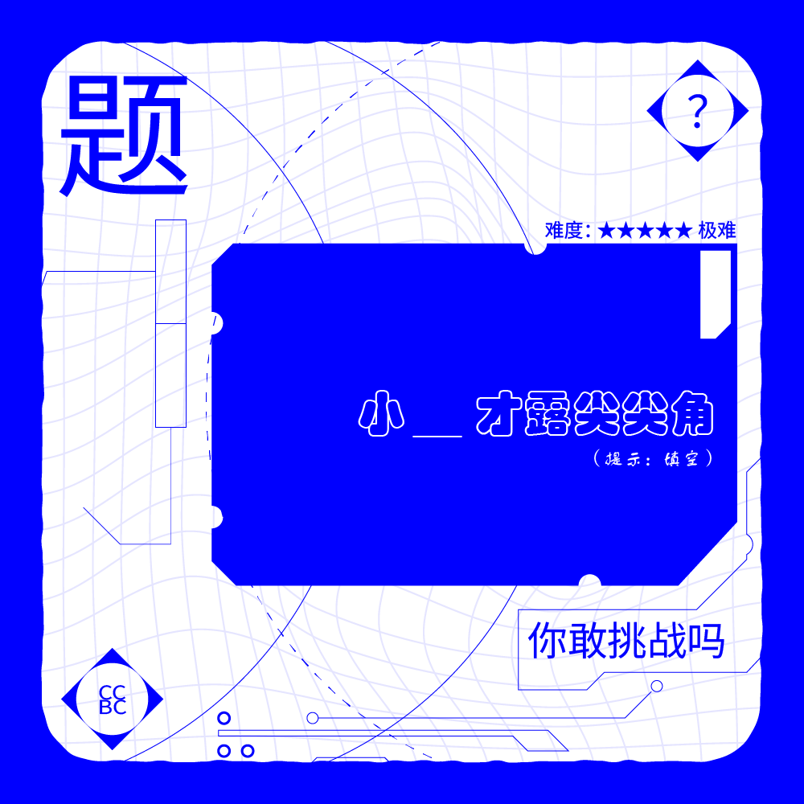

# 千字谜子题 57

## 题面

## 答案

`荷`

## 解析

诗词填空即可。其余为无关信息。

## 本地附件

- [81056211c7ec4c3894e8ad0b4dc165e6.webp](../../../assets/static.cipherpuzzles.com/static/images/81056211c7ec4c3894e8ad0b4dc165e6.webp)

来源：[https://ccbc16.cipherpuzzles.com/data/c16-qian-puzzle.json#cid=57](https://ccbc16.cipherpuzzles.com/data/c16-qian-puzzle.json#cid=57)
