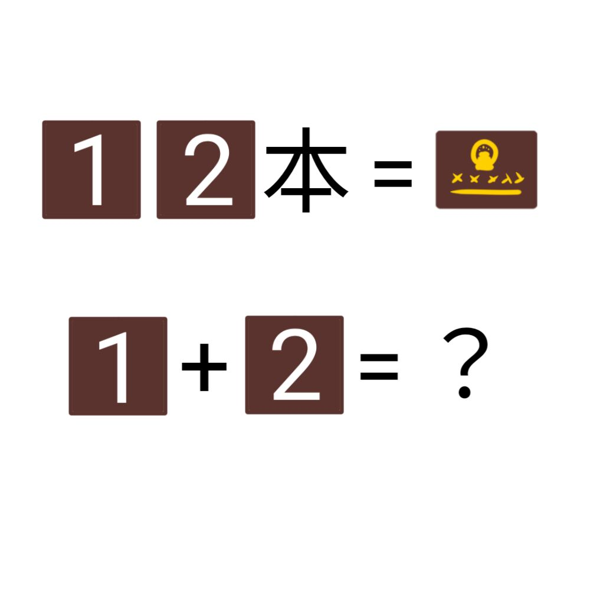

# 千字谜子题 576

## 题面

## 答案

`启`

## 解析

户+口=启

## 本地附件

- [a46d88466e564fb4be0666526412f734.webp](../../../assets/static.cipherpuzzles.com/static/images/a46d88466e564fb4be0666526412f734.webp)

来源：[https://ccbc16.cipherpuzzles.com/data/c16-qian-puzzle.json#cid=576](https://ccbc16.cipherpuzzles.com/data/c16-qian-puzzle.json#cid=576)
