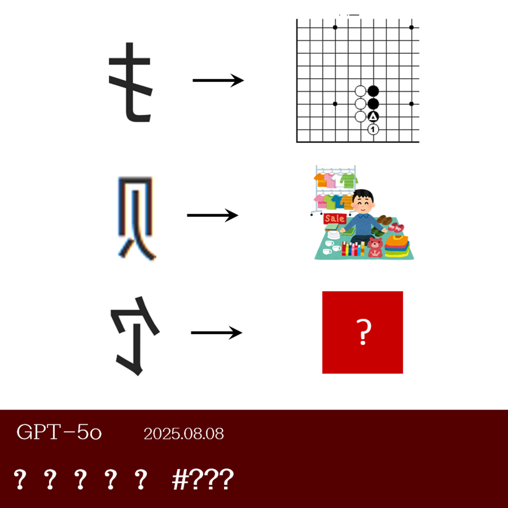

# 千字谜子题 58

## 题面

## 答案

`饭`

## 解析

题目三行箭头左侧为反置的三个偏旁部首：提手旁、贝字旁、食字旁。提手旁对应的第一张图片为围棋中“扳”的示意；贝字旁对应的第二章图片为正在“贩”卖货物的商人。由此推断箭头的规则是由箭头左侧部首和“反”字合成箭头右侧汉字。因此最后一行即将食字旁与“反”字合成，得到正确答案“饭”。

## 本地附件

- [e8caa1fc631a41c09caa9fb8b2db98b7.webp](../../../assets/static.cipherpuzzles.com/static/images/e8caa1fc631a41c09caa9fb8b2db98b7.webp)

来源：[https://ccbc16.cipherpuzzles.com/data/c16-qian-puzzle.json#cid=58](https://ccbc16.cipherpuzzles.com/data/c16-qian-puzzle.json#cid=58)
