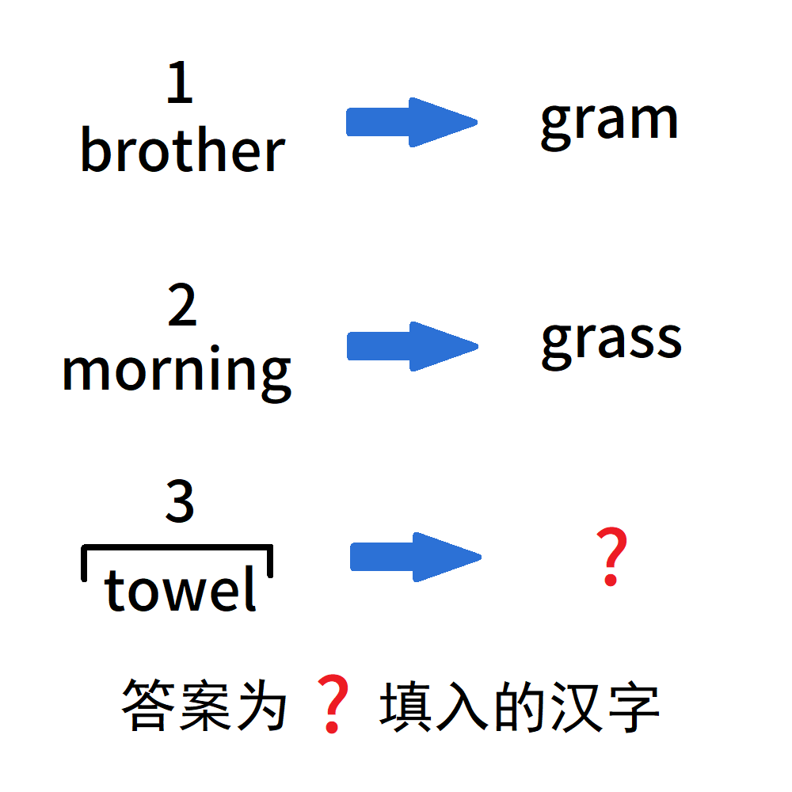

# 千字谜子题 59

## 题面

## 答案

`带`

## 解析

将英文翻译成中文。
第一行表示“兄”上加“十”变为“克”；
第二行表示“早”上加草字头（“艹”）变为“草”。
发现数字对应一横加几竖，所以第三行为一横三竖，秃宝盖和“巾”组合的字，答案为“带”。

## 本地附件

- [024e569db98248eeb6aa49b2c8534228.webp](../../../assets/static.cipherpuzzles.com/static/images/024e569db98248eeb6aa49b2c8534228.webp)

来源：[https://ccbc16.cipherpuzzles.com/data/c16-qian-puzzle.json#cid=59](https://ccbc16.cipherpuzzles.com/data/c16-qian-puzzle.json#cid=59)
