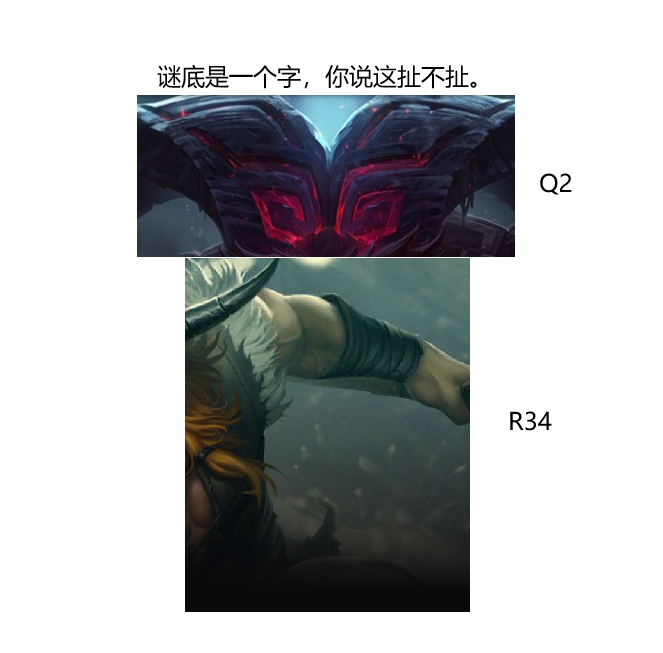

# 千字谜子题 60

## 题面

## 答案

`岁`

## 解析

奥恩q技能第二个字：山
奥拉夫r技能第三四个字：黄昏->夕

## 本地附件

- [0adf24e4cbdd4a299be472da3dc87f47.webp](../../../assets/static.cipherpuzzles.com/static/images/0adf24e4cbdd4a299be472da3dc87f47.webp)

来源：[https://ccbc16.cipherpuzzles.com/data/c16-qian-puzzle.json#cid=60](https://ccbc16.cipherpuzzles.com/data/c16-qian-puzzle.json#cid=60)
