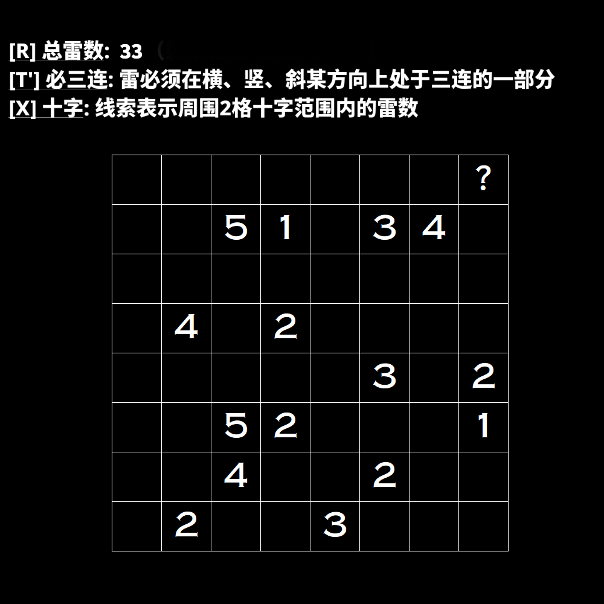

# 千字谜子题 61

## 题面

## 答案

`所`

## 解析

解出14mv纸笔后，观察地雷排布即可象形得到“所”字。

## 本地附件

- [975e032344004861987638bc17c004a2.webp](../../../assets/static.cipherpuzzles.com/static/images/975e032344004861987638bc17c004a2.webp)

来源：[https://ccbc16.cipherpuzzles.com/data/c16-qian-puzzle.json#cid=61](https://ccbc16.cipherpuzzles.com/data/c16-qian-puzzle.json#cid=61)
