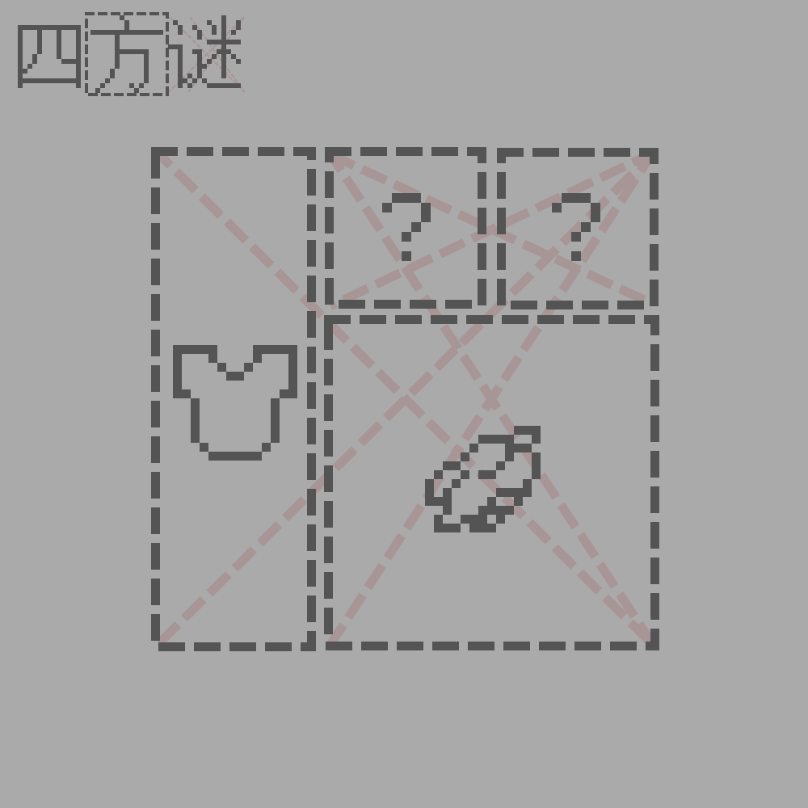

# 千字谜子题 62

## 题面

## 答案

`习`

## 解析

观察题目名称。发现“方”有边框，推测方框代表字。“谜”有红虚线交叉，分别对应“谜”“迷”两个字，推测一个红叉代表一个字。
观察题面。两个图标对应minecraft中的胸甲和骨粉，推测白色染料对应字为“白”，胸甲对应字为“衣”（作为偏旁部首更合适）。上方问号分别对应一个框，推测为两个相同的字组字。
最终（瞪眼法、查阅字统网或其他方法）得出最外部的字为“褶”。最终答案提取问号的字“习”。

## 本地附件

- [c5fec4ed5b8d42f58568a0e3f5b0c18b.webp](../../../assets/static.cipherpuzzles.com/static/images/c5fec4ed5b8d42f58568a0e3f5b0c18b.webp)

来源：[https://ccbc16.cipherpuzzles.com/data/c16-qian-puzzle.json#cid=62](https://ccbc16.cipherpuzzles.com/data/c16-qian-puzzle.json#cid=62)
