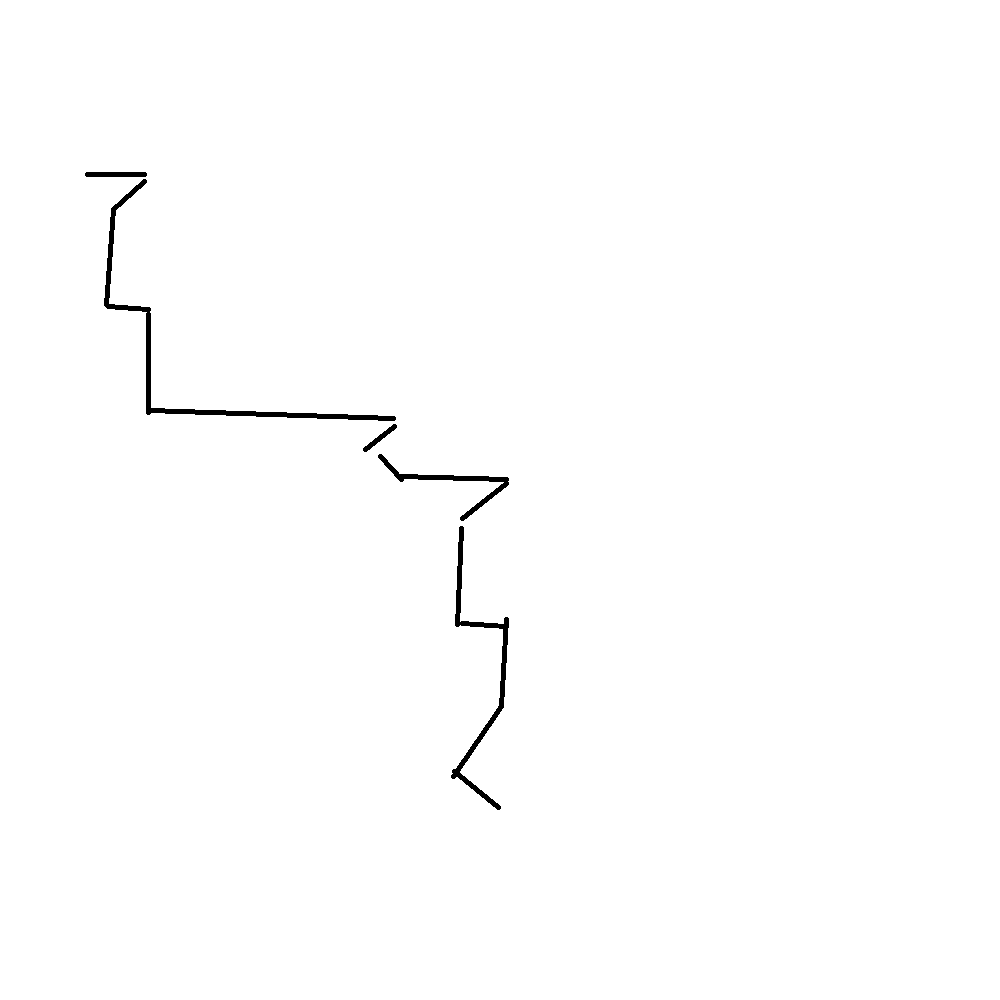

# 千字谜子题 63

## 题面

（十六）

## 答案

`颠`

## 解析

摘自一笔画。

## 本地附件

- [a69fdd3a748c41959d53f351abd9a0e4.webp](../../../assets/static.cipherpuzzles.com/static/images/a69fdd3a748c41959d53f351abd9a0e4.webp)

来源：[https://ccbc16.cipherpuzzles.com/data/c16-qian-puzzle.json#cid=63](https://ccbc16.cipherpuzzles.com/data/c16-qian-puzzle.json#cid=63)
