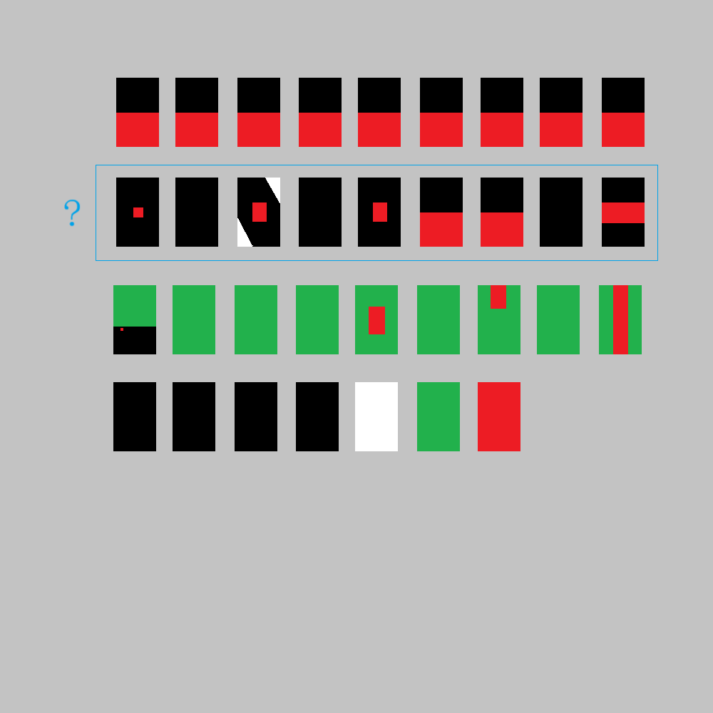

# 千字谜子题 65

## 题面

（十二）

## 答案

`筒`

## 解析

这是所有麻将牌的抽象图（以立直麻将常用的牌面为准），其中框住的一行是所有筒子牌，所以答案是筒。

## 本地附件

- [65ed9f705a7a42ac86fd17eafd4202a2.webp](../../../assets/static.cipherpuzzles.com/static/images/65ed9f705a7a42ac86fd17eafd4202a2.webp)

来源：[https://ccbc16.cipherpuzzles.com/data/c16-qian-puzzle.json#cid=65](https://ccbc16.cipherpuzzles.com/data/c16-qian-puzzle.json#cid=65)
