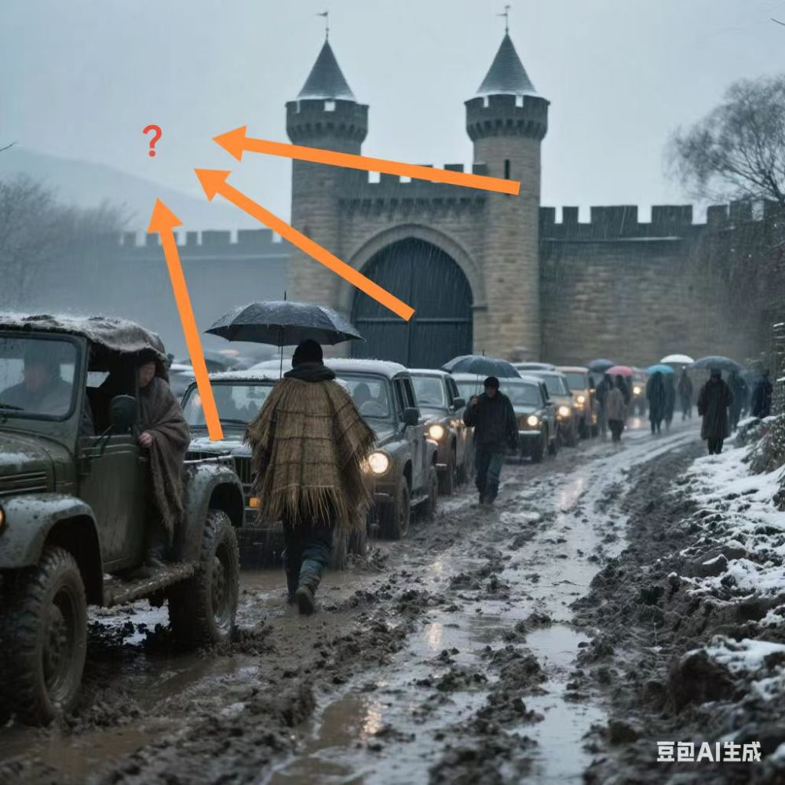

# 千字谜子题 66

## 题面

多音字
（十三）

## 答案

`塞`

## 解析

三个箭头的位置分别是塞的三个读音
要塞 sai4
堵塞 se4
塞车 sai1
公共的字是“塞”

## 本地附件

- [c409220a844544288dfa8c16d303727d.webp](../../../assets/static.cipherpuzzles.com/static/images/c409220a844544288dfa8c16d303727d.webp)

来源：[https://ccbc16.cipherpuzzles.com/data/c16-qian-puzzle.json#cid=66](https://ccbc16.cipherpuzzles.com/data/c16-qian-puzzle.json#cid=66)
