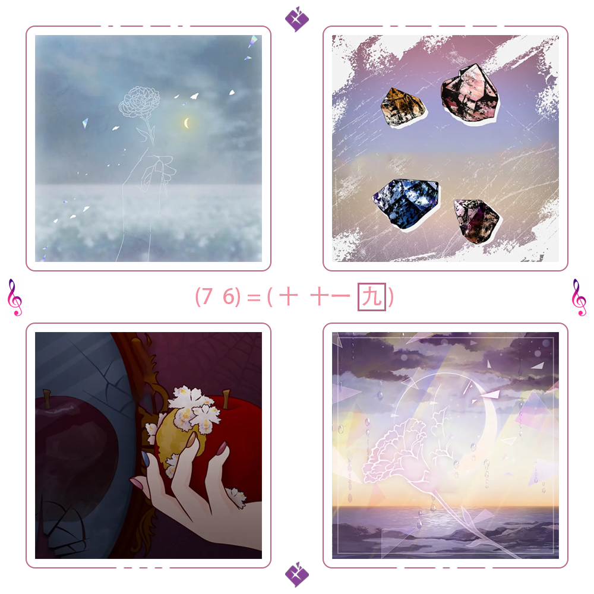

# 千字谜子题 67

## 题面

## 答案

`奏`

## 解析

观察到四张图片的边框外沿存在长短区分明显的不同线段，通过摩斯码可以解码得到p、j、s、k四个字母。
搜索指向了pjsk是游戏《世界计划 彩色舞台 feat. 初音未来》的缩写。
图片上下附有的标记能在该游戏相关内容中找到，是"25点，Nightcord见。"组合的徽标。图片左右的音符标记暗示了图片与音乐相关。
进一步在相关信息（该组合的演唱曲目，或该游戏的收录曲目）中查找四角的四张图片，可以发现均为该游戏中的原创VOCALOID曲的封面，即：
左上 《カナデトモスソラ》
右上 《トリコロージュ》
左下 《

## 本地附件

- [542ce53632314efe89c1ec39b1a7a06e.webp](../../../assets/static.cipherpuzzles.com/static/images/542ce53632314efe89c1ec39b1a7a06e.webp)

来源：[https://ccbc16.cipherpuzzles.com/data/c16-qian-puzzle.json#cid=67](https://ccbc16.cipherpuzzles.com/data/c16-qian-puzzle.json#cid=67)
