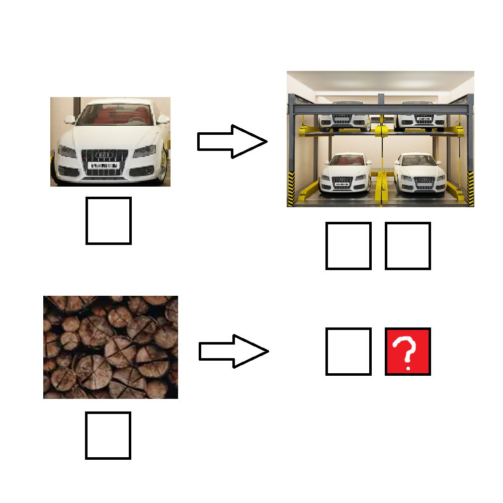

# 千字谜子题 68

## 题面

## 答案

`床`

## 解析

车->车库

床->木床

提取床

## 本地附件

- [9c03c4cc138e4149993b9865ee525bc2.webp](../../../assets/static.cipherpuzzles.com/static/images/9c03c4cc138e4149993b9865ee525bc2.webp)

来源：[https://ccbc16.cipherpuzzles.com/data/c16-qian-puzzle.json#cid=68](https://ccbc16.cipherpuzzles.com/data/c16-qian-puzzle.json#cid=68)
