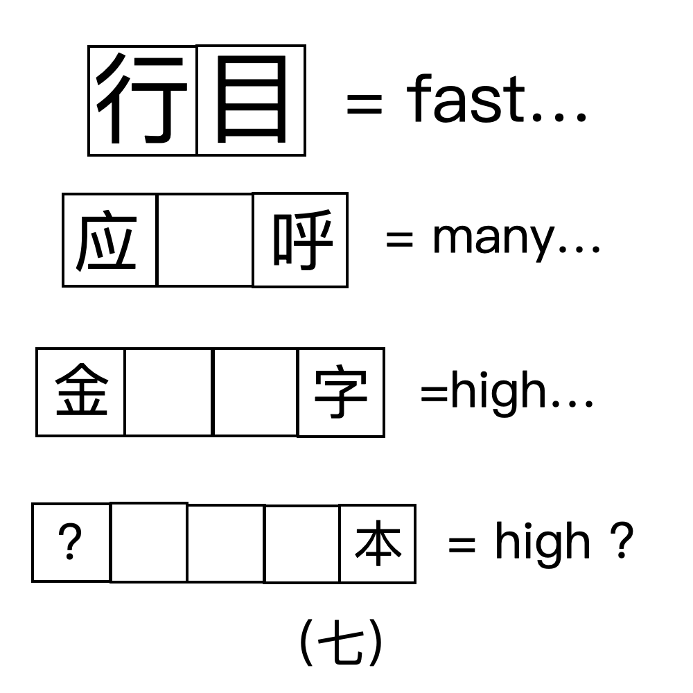

# 千字谜子题 69

## 题面

## 答案

`利`

## 解析

从上到下分别为：一目十行、一呼百应、一字千金、一本万利。提取利。

## 本地附件

- [7e6974d3086b492ab42705be8ef871f9.webp](../../../assets/static.cipherpuzzles.com/static/images/7e6974d3086b492ab42705be8ef871f9.webp)

来源：[https://ccbc16.cipherpuzzles.com/data/c16-qian-puzzle.json#cid=69](https://ccbc16.cipherpuzzles.com/data/c16-qian-puzzle.json#cid=69)
