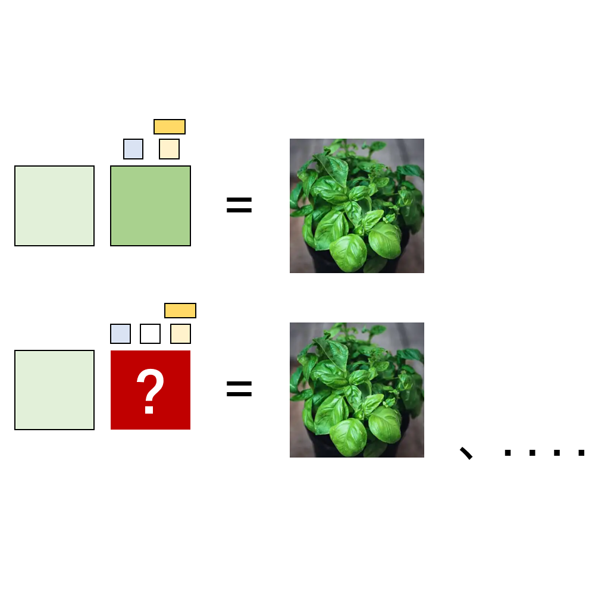

# 千字谜子题 70

## 题面

## 答案

`列`

## 解析

是一道日谜，上面两个字以及右侧图片是罗勒，下面两个字是罗列。可从拼音对应以及等号右边表示罗列的行为推理得出，因此答案为"列"

## 本地附件

- [f40a71d15e1a486390d447f0abcac256.webp](../../../assets/static.cipherpuzzles.com/static/images/f40a71d15e1a486390d447f0abcac256.webp)

来源：[https://ccbc16.cipherpuzzles.com/data/c16-qian-puzzle.json#cid=70](https://ccbc16.cipherpuzzles.com/data/c16-qian-puzzle.json#cid=70)
